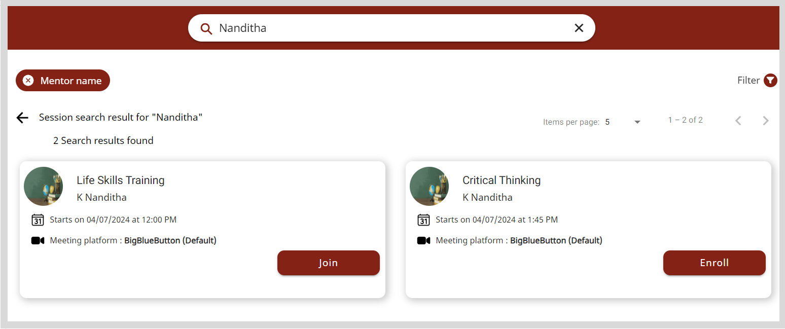

import Admonition from '@theme/Admonition';

To find upcoming sessions, enter a keyword such as the session title or mentor's name in the **Search** box and press **Enter**. The search results appear as session tiles.
    

To refine your search results, you can also search for sessions based on a specific category. Click here for the following actions:

1. To specify the search category, click the **Search** box and select a search category such as **Mentor name**.

2. Enter the search keyword. Based on the specified search category, the search results appear as session tiles.

    

**From the search results, you can find the respective session using the following ways:**

* Viewing the search results on different pages by clicking the <b>Next</b> or <b>Previous</b> buttons.
* Changing the number of search results listed on the page using the <b>Items per page</b> dropdown.
* Applying filters as follows:

    * Click on <b>Filter</b>.
    * Select one or more filters and click <b>Apply</b>.
        

        <Admonition type="tip">
        
To clear filters, do one of the following actions:

        <ul>
        <li>Clear the filter checkbox.</li>
        <li>Click <b>Clear all</b> to clear all the applied filters.</li>
        </ul>
        </Admonition>
        
