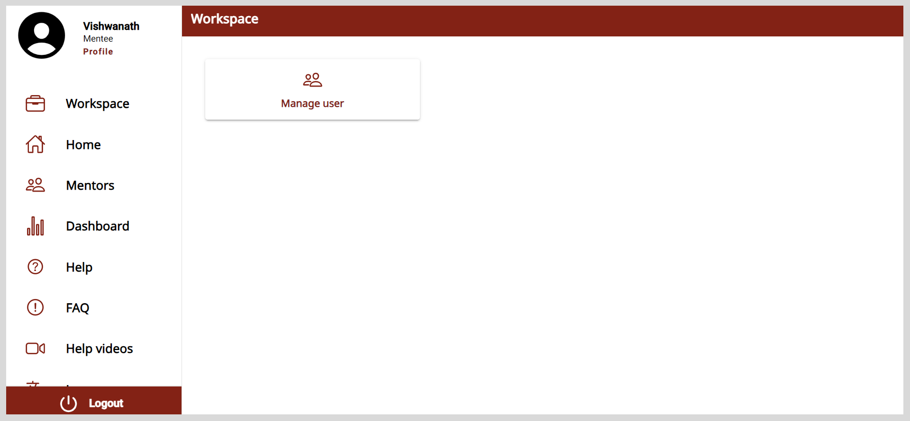

# Organization Administrator

Any registered user on the application can be assigned the role of an organization administrator. After receiving organization administrator permissions, the user will receive an email notification.

The organization administrator can perform the following actions:

* Manage requests to a be a mentor.
* Upload the list of users with assigned roles to the application.

After logging in to the application, you will find an **Admin Workspace** option on the **Application** menu.

