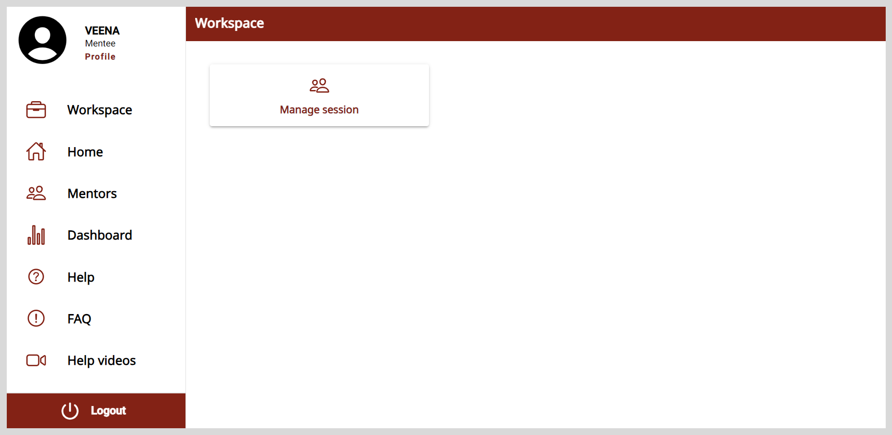

import SignUp from './_signup.mdx';
import Admonition from '@theme/Admonition';

# Session Manager

Session managers can gain oversight of the mentoring program at an organization by:

* Creating (Public or Private) sessions.
* Assigning the sessions to respective mentors. The assigned sessions are hosted by mentors during the scheduled time.
* Inviting mentees to the sessions.
* Conducting session management activities such as updating the session and meeting details and tracking the session's status and mentee enrollments.

You can access the Session Manager account using one of the following ways:

* If you are signing up for the first time, use the application's link included in the email invite.
* If you are a registered user, you will receive an email notification after being assigned the role of a Session Manager. After logging in, a **Workspace** appears on the application.

    <Admonition type="note">    
    
To access your Home page and other application features, your profile must be complete.

    </Admonition>

    

## Signing up

After receiving the application's link, you must sign up to create an account.

**To sign up, do as follows:**

<SignUp />

### Logging out

To log out, do one of the following actions:

* Select <b>Logout</b> from the <b>Application</b> menu.

* Go to the <b>Application</b> menu  and select <b>Logout</b>.

