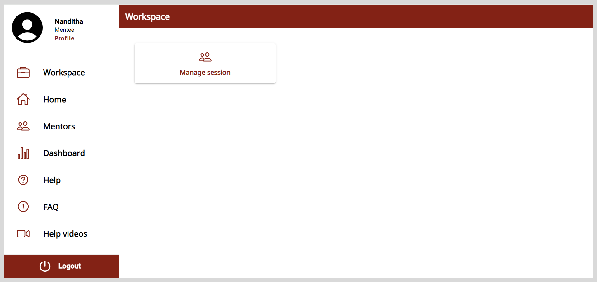

import SignUp from './_signup.mdx';

# Session Manager

Session managers can create Public or Private sessions and do the following actions:

* Assign the sessions to mentors.
* Invite mentees to the sessions.
* Manage the sessions.
* Monitor the session's status.

You can access the Session Manager account using one of the following ways:

* If you are signing up for the first time, use the application's link included in the email invite.
* If you are a registered user, you will receive an email notification after being assigned the role of a Session Manager. After logging in, a **Workspace** appears on the application.

## Signing up

After receiving the application's link, you must sign up to create an account.

**To sign up, do as follows:**

<SignUp />

8. Click <b>Verify and login</b>. After logging in, a **Workspace** appears on the application.

    

### Logging out

To log out, do one of the following actions:

* Select <b>Logout</b> from the <b>Application</b> menu.

* Go to the <b>Application</b> menu  and select <b>Logout</b>.

