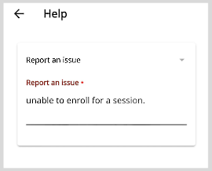
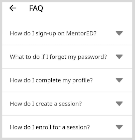

# Using the Application Menu

In the **Application** menu, you can find options such as **Help**, **FAQ**, **Help videos**, and **Language** for a comfortable learning experience.

## Reporting an Issue

You can write to the support team about any problems you faced while using the application.

**To report an issue, do as follows:**

1. Go to the **Application** menu 

 and select **Help**.

2. Enter the details of the issue you faced.

    

3. Tap **Submit**. Your issue is reported successfully.

## Using the FAQ Page

You can find answers to commonly asked questions about the application.

**To view the FAQ page, do as follows:**

1. Go to the **Application** menu 

 and select **FAQ**.

3. On the FAQ page, tap the drop-down icon located next to question to view the answer.

    

## Viewing the Help Videos

You can find video instructions about using the application features.

**To view the video instructions, do as follows:**

1. Go to the **Application** menu  

 and select **Help Videos**.

2. Tap on the appropriate tile to play the video instructions.

    

## Changing the Language Settings

You can use the application in a language of your choice.

**To change the language settings, do as follows:**

1. Go to the **Application** menu 

 and select **Language**.

2. On the Language page, tap a **Language** button of your choice.

    

3. Tap **Submit**. The text on the application user interface now appears in the language that you have chosen.

