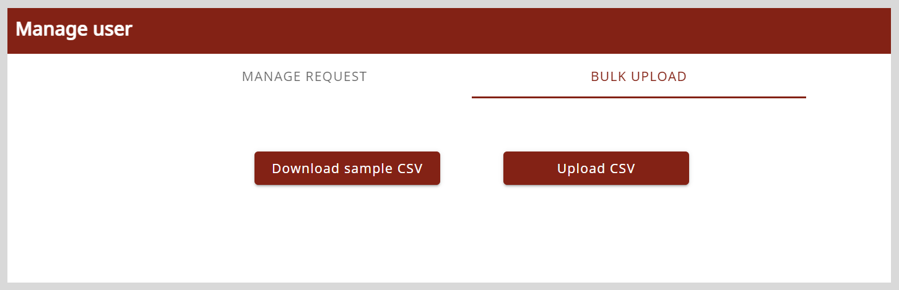

import Admonition from '@theme/Admonition';

# Uploading Users to the Application

The organization administrator can upload the list of users to the application using a CSV file to:

* Invite new users whose roles (mentor and mentee) are already assigned.

* Invite registered users to an organization. After uploading the list of registered users, they are assigned an organization.

* Provide an existing user the permission to host sessions by changing role to mentor.

**To upload users to the application, do as follows:**

1. Go to the <b>Application</b> menu  and select **Admin Workspace**.

2. On the Admin Workspace page, click **Manage user**.

3. On the **Bulk Upload** tab, click **Download Sample CSV** to download the sample CSV file.

4. Open the downloaded CSV file and clear the sample details on the file.

    

5. Enter the following user information to the file:

    * Email ID
    * Assigned role
 
6. On the **Bulk Upload** tab, click **Upload CSV** and upload the file containing the list of users. The user entries are uploaded.

    <Admonition type="tip">
    
You will receive an email notification containing a CSV file with the following information about the list of users:

    <ul>
    <li>Assigned user ID</li>
    <li>Whether the user uploaded to the application already exists</li>
    </ul>
    </Admonition>