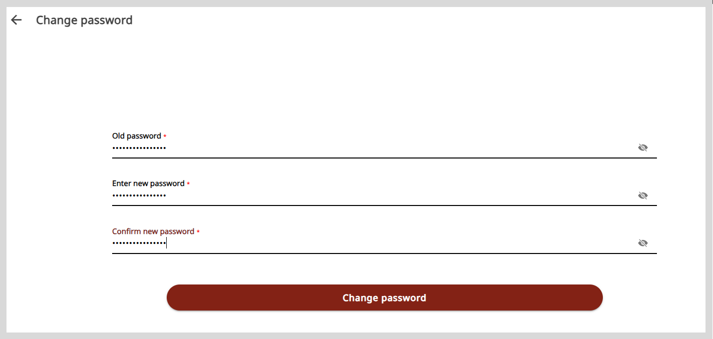

import Admonition from '@theme/Admonition';
import BurgerMenu from './media/burgermenu-icon.png'

# Changing the Account Password

For a secure account, you can change your existing password if:

* You notice a login from an unfamiliar device on the <a href="accountloginactivity">Login activity page</a>.
* You suspect that your account password is compromised.

  <Admonition type="tip">
  
After changing the password, you are logged out from all devices.

  </Admonition>

**To change the account password, do as follows:**

1. Do one of the following actions:

    * Select <b>Change password</b> from the <b>Application</b> menu.
    * Go to the <b>Application</b> menu  and select <b>Change password</b>.

2. Enter your old password and the new password.

    

3. Click **Change password**. You will be logged out of your account.

4. To access your account, log in using your new credentials.