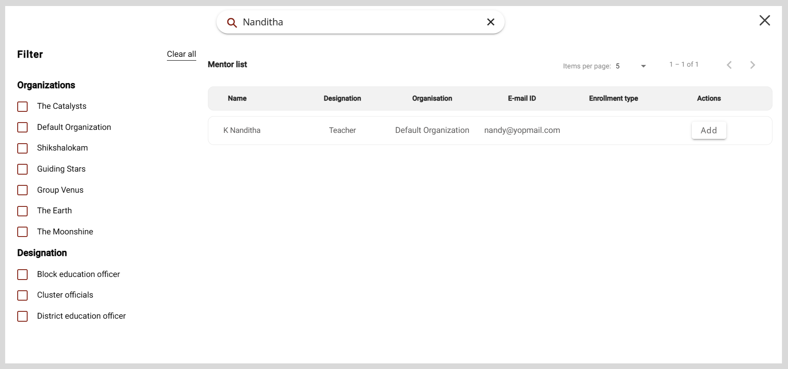
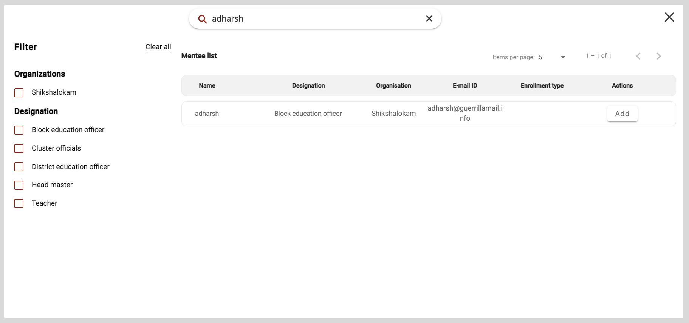

import PartialExample from './_mentored.mdx';
import Admonition from '@theme/Admonition';

# Creating Sessions for an Organization

You can create Public or Private sessions for an organization and do the following actions:

* Assign the session to the respective mentor.
* Invite mentees to the session.
* Add the session information such as the session topic and schedule.
* Add the meeting platform.

**To create a session, do as follows:**

1. Do one of the following actions:

    * Select <b>Workspace</b> from the <b>Application</b> menu.
    * Go to the <b>Application</b> menu  and select <b>Workspace</b>.

2. On the <b>Workspace</b> page, click <b>Manage session</b>.

3. Click <b>Create session</b>. The Create a new session page appears.

    

4. Optionally, to add a session image, click <b>Add image</b> and do one of the following actions:

    * To take a picture, select <b>Take Photo</b>.
    * To upload an image, select <b>Choose from library</b>.
        
  
        <Admonition type="tip">
        
Select an image that is relevant to the session topic.

        </Admonition>
        

5. Enter the session information in the <b>Session title</b> and <b>Description</b> boxes.

6. To select the type of session, do as follows:

    1. Click the <b>Session type</b> box.
    2. Select the session type from the <b>Session type</b> dropdown and click <b>Ok</b>.

    
  
        <Admonition type="note">
        
You cannot change the session type after publishing the session.

        </Admonition>
    

7. To assign the session to a mentor, do as follows:

    1. Click <b>+ Add mentor</b>. The Mentor list window appears.
    2. Find a mentor from the list and click <b>Add</b>.

        
  
        <Admonition type="tip">
        
To assign the session to a different mentor, do as follows:

        <ol>
        <li>In the <b>+ Add mentor</b> box, click the mentor's name was previously selected.</li>
        <li>Find a new mentor and click <b>Add</b>.</li>
        </ol>
        </Admonition>
        

        

    
  
        <Admonition type="note"> 
        
After publishing the session, you cannot assign the session to a different mentor.

        </Admonition>
    

    
  
        <Admonition type="tip">
        
From the Mentor or Mentee list window, you can find users by:

        <ul>
        <li>Searching for the user in the <b>Search</b> box.</li>
        <li>Using filters such as the user's organization or designation.</li>
        <li>Changing the number of users listed on the page using the <b>Items per page</b> dropdown.</li>
        </ul>
        </Admonition>
    

8. To invite mentees, do as follows:

    1. Click <b>+ Add mentee</b>. The Mentee list window appears.
    2. Find a mentee from the list and click <b>Add</b>.

        

    
  
        <Admonition type="tip">
        
It is optional to invite mentees to a Public session.

        </Admonition>
    

    
  
        <Admonition type="note">
        
You cannot add mentees after the session enrollment limit is reached. If you add new mentees after this limit is reached, a <i>session seats full</i> message appears.

        </Admonition>
    

9. To schedule a session, do as follows:

    1. Click the <b>Start date</b> and <b>End date</b> boxes.
    2. Select the date and time from the date and time picker.
    3. Click .

    
  
        <Admonition type="note">
        
The session duration should be at least 30 minutes.

        </Admonition>
    

10. Select an option from the following boxes:

    * <b>Recommended for</b>
    * <b>Categories</b>
    * <b>Medium</b>

    

        <Admonition type="tip">
        <ul>
        <li>To cancel the selection, click the option again.</li>
        <li>To add a new option, do as follows:</li>
            <ol>
            <li>Click <b>+ Add</b> and enter the new option.</li>
            <li>Click <b>Ok</b>.</li>
            </ol>
        <li>To select all the options, turn on the toggle.</li>
        </ul>
        </Admonition>
    

      

11. Click <b>Publish and add link</b>. The session is published on the platform and participants can now view your session.

    

        <Admonition type="note">
        
You must set the meeting platform on the <b>Meeting Link</b> tab.

        </Admonition>
    

    

    

        <Admonition type="tip">
        
To go back and edit the session details, do as follows:

        <ol>
        <li>Go to the <b>Edit session</b> tab.</li>
        <li>Make the necessary changes and click <b>Save</b>.</li>
        </ol>
        </Admonition>
    

12. On the <b>Meeting link</b> tab, select a meeting platform from the <b>Add meeting link</b> menu.
    
    

        <Admonition type="note">
        
If you haven't selected a meeting platform, <b>BigBlueButton</b> is set as the default platform.

        </Admonition>
    

    <table>
    <tr>
        <th>Meeting Platform</th>
        <th>Meeting Information</th>
    </tr>
    <tr>
        <td>BigBlueButton</td>
        <td>No action required.</td>
    </tr>
    <tr>
        <td>Google Meet</td>
        <td>Copy and paste the call link in the <b>Meet link</b> box.</td>
    </tr>
    <tr>
        <td>WhatsApp</td>
        <td>Copy and paste the call link in the <b>WhatsApp</b> box.</td>
    </tr>
    <tr>
        <td>Zoom</td>
        <td>
Do the following actions:
<ol><li>Copy and paste the meeting link in the <b>Zoom link</b> box.</li><li>Copy and paste the meeting ID in the <b>Meeting ID</b> box.</li><li>Copy and paste the passcode in the <b>Passcode</b> box.</li></ol></td>
    </tr>
    </table>

13. Click <b>Submit</b>. The meeting information is added.

    

        <Admonition type="tip">
        
You can find the sessions that are assigned to mentors and track their progress on the Session list section.

        </Admonition>
    

