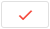
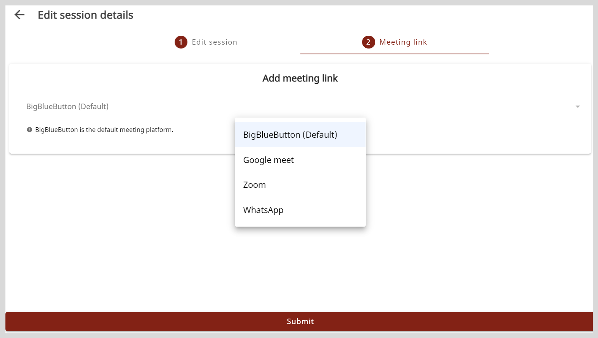

import PartialExample from './_mentored.mdx';
import Admonition from '@theme/Admonition';
import BulkUploadTable from './_sessionbulkuploadtable.mdx';
import FormFieldsNote from './_formfieldscustomizability.mdx';

# Creating Sessions for an Organization

You can create and schedule sessions between mentor and mentees.

Sessions can be created using any one of the following methods:

* Using the **Create session** button
* Using bulk upload

## Using the Create Session Button

**To create a session, do as follows:**

1. Do one of the following actions:

    * Select <b>Workspace</b> from the <b>Application</b> menu.
    * Go to the <b>Application</b> menu  and select <b>Workspace</b>.

2. On the Workspace page, click <b>Manage session</b>.

3. Go to the **Create sessions** tab.

4. Click the <b>Create session</b> button. The Create a new session page appears.

    

5. Optionally, to add a session image, click <b>Add image</b> and do one of the following actions:

    * To take a picture, select <b>Take Photo</b>.
    * To upload an image, select <b>Choose from library</b>.
        
  
        <Admonition type="tip">
        
Select an image that is relevant to the session topic.

        </Admonition>
        

6. Enter the session information in the <b>Session title</b> box and <b>Description</b> box.

    <FormFieldsNote />

7. To select the type of session, do as follows:

    1. Click the <b>Session type</b> box.
    2. Select the session type from the <b>Session type</b> dropdown and click <b>Ok</b>.

    
  
        <Admonition type="note">
        
You cannot change the session type after publishing the session.

        </Admonition>
    

8. To assign the session to a mentor, do as follows:

    1. Click <b>+ Add mentor</b>. The Mentor list window appears.
    2. Find a mentor from the list and click <b>Add</b>.

        
  
        <Admonition type="tip">
        
To assign the session to a different mentor, do as follows:

        <ol>
        <li>In the <b>+ Add mentor</b> box, click the mentor's name that was previously selected.</li>
        <li>Find a new mentor and click <b>Add</b>.</li>
        </ol>
        </Admonition>
        

        

    
  
        <Admonition type="note"> 
        
After publishing the session, you cannot assign the session to a different mentor.

        </Admonition>
    

    
  
        <Admonition type="tip">
        
From the Mentor or Mentee list window, you can find users by:

        <ul>
        <li>Searching for the user in the <b>Search</b> box.</li>
        <li>Using filters such as the user's organization or designation.</li>
        <li>Changing the number of users listed on the page using the <b>Items per page</b> dropdown.</li>
        </ul>
        </Admonition>
    

9. To invite mentees, do as follows:

    1. Click <b>+ Add mentee</b>. The Mentee list window appears.
    2. Find a mentee from the list and click <b>Add</b>.

        

    
  
        <Admonition type="tip">
        <ul>
        <li>It is optional to invite mentees to a Public session.</li>
        <li>To facilitate one-on-one mentoring, you can set up Private sessions consisting of an invited mentee.</li>
        </ul>
        </Admonition>
    

    
  
        <Admonition type="note">
        
You cannot add mentees after the session enrollment limit is reached. If you add new mentees after this limit is reached, a <i>session seats full</i> message appears.

        </Admonition>
    

10. To schedule a session, do as follows:

    1. Click the <b>Start date</b> box and <b>End date</b> box.
    2. Select the date and time from the date and time picker.
    3. Click .

    
  
        <Admonition type="note">
        
The session duration should be at least 30 minutes.

        </Admonition>
    

11. Select an option from the following:

    * <b>Recommended for</b>
    * <b>Categories</b>
    * <b>Medium</b>  

      
    
12. Click **+Select Recommended for**. The **Select Recommended for** window appears. 

     

13. Select the checkbox for the options that you want to recommend. You can also do a quick search using the search bar. Type one or 
    more letters in the search bar. The items are displayed based on the search term you typed.

14. Do one of the following actions:
    * Click **Save** to save the selected Recommended options.
    * Click **Clear all** to clear the selected options.   
    * Click **X** to close the window without saving the changes.

15. After you click **Save**, the selected items appears under the **+Select Recommended for** section.  

    

16. To add a new item, click **+Other**. This opens a popup window.  

      
    
17. Enter the recommended item that you would like to add and then click **Ok**.
    The newly added item appears as **+1more** as shown in the following figure.  

        

    
      

        <Admonition type="note">
        A maximum of five options will be shown.
        If there are more than five options, they will be denoted with <b>“+number of additional options.</b>" 
        For example, if 11 options are selected, the first five will appear under the <b>+ Select Recommended for</b> section,
        while the remaining six will be shown as <b>"+6more"</b>.
        </Admonition>
    
  
    
18. Repeat the same procedure as **+Select Recommended for**, to select the categories and the medium for creating a session.  

    

19. Click <b>Publish and add link</b>. The session is published on the platform and mentees can now view the session.

    

        <Admonition type="note">
        
You must set the meeting platform on the <b>Meeting Link</b> tab.

        </Admonition>
    

    

    

        <Admonition type="tip">
        
To go back and edit the session details, do as follows:

        <ol>
        <li>Go to the <b>Edit session</b> tab.</li>
        <li>Make the necessary changes and click <b>Save</b>.</li>
        </ol>
        </Admonition>
    

20. On the <b>Meeting link</b> tab, select a meeting platform from the <b>Add meeting link</b> menu.
    
    

        <Admonition type="note">
        
If you have not selected a meeting platform, <b>BigBlueButton</b> is set as the default platform.

        </Admonition>
    

    <table>
    <tr>
        <th>Meeting Platform</th>
        <th>Meeting Information</th>
    </tr>
    <tr>
        <td>BigBlueButton</td>
        <td>No action required.</td>
    </tr>
    <tr>
        <td>Google Meet</td>
        <td>Copy and paste the call link in the <b>Meet link</b> box.</td>
    </tr>
    <tr>
        <td>WhatsApp</td>
        <td>Copy and paste the call link in the <b>WhatsApp</b> box.</td>
    </tr>
    <tr>
        <td>Zoom</td>
        <td>
Do the following actions:
<ol><li>Copy and paste the meeting link in the <b>Zoom link</b> box.</li><li>Copy and paste the meeting ID in the <b>Meeting ID</b> box.</li><li>Copy and paste the passcode in the <b>Passcode</b> box.</li></ol></td>
    </tr>
    </table>

21. Click <b>Submit</b>. The meeting information is added.

    

        <Admonition type="tip">
        
You can find the sessions that are assigned to mentors and track their progress on the Session list section.

        </Admonition>
    

## Using Bulk Upload

For an organization's mentorship program, you can create and schedule multiple sessions between mentors and mentees. 

**To create sessions through bulk upload, do as follows:**

1. Do one of the following actions:

    * Select <b>Workspace</b> from the <b>Application</b> menu.
    * Go to the <b>Application</b> menu  and select <b>Workspace</b>.

2. On the Workspace page, click **Manage session**.

3. Go to the **Bulk upload** tab.

4. Click **Download sample CSV** to download the sample CSV file. The downloaded sample file contains information that you must clear before adding the session details.

5. Open the downloaded CSV file and clear the sample details.

6. Enter *Create* in the **Action** column.

7. Leave the **ID** column as blank.

8. Enter the session information as per the following table:

    <BulkUploadTable />

9. On the **Bulk upload** tab, click **Upload CSV** and select the CSV file containing the list of sessions. To view the published sessions and their session IDs, go to the **Create sessions** tab.

    

    <Admonition type="note">
    
After creating sessions, you will receive a CSV file in your email that displays details such as:

    <ul>
    <li>ID</li>
    <li>Session status (<i>Published</i> or <i>Invalid</i>)</li>
    <li>Status message</li>
    </ul>
    
If the details entered in the uploaded CSV need corrections, the session status would be <i>invalid</i> and the session is not published. In such cases, refer to the status message and reupload the respective file with the updated details.

To make the necessary updates, see the <a href="bulkupload-invalidsession">Troubleshooting Invalid Messages</a> section.

    </Admonition>
    

