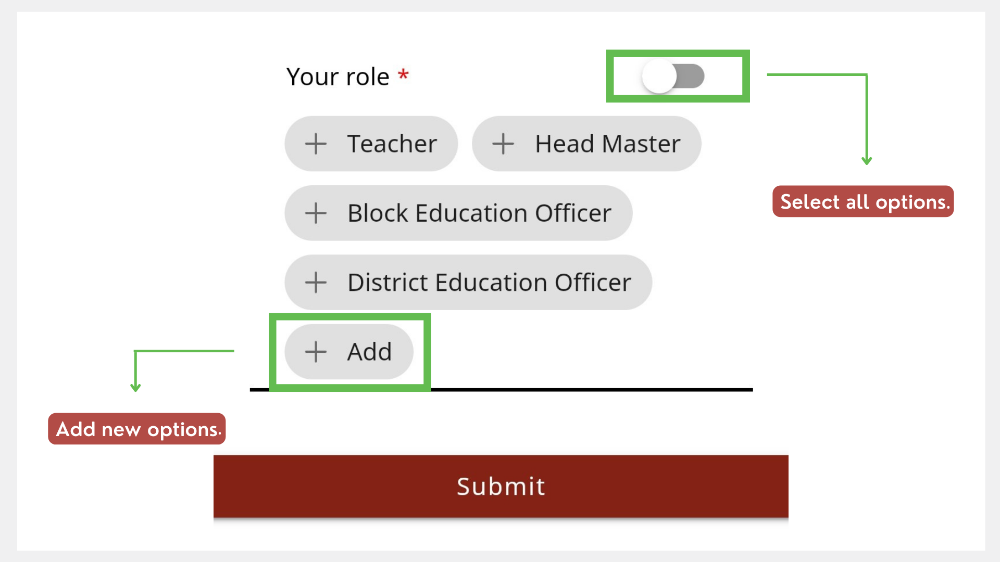

# Creating and Managing a Mentor Profile

You can update your profile details to help mentees get to know you. 

> :::note
> You can use the application only after updating your profile. 

1.  Go to the **Profile** tab and tap **Edit**.

    

2.  Enter your details.

    

3.  If you want to add a profile picture, tap **Add Image**. Select **Take Photo** or **Choose from Library**.

4.  Tap **Submit**.