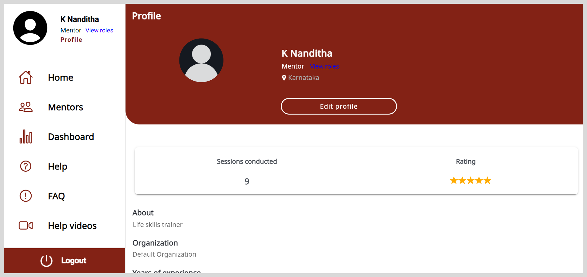

import ProfileIcon from './media/profile-icon.png';
import BurgerMenu from './media/burgermenu-icon.png'
import PortalAppMenu from './media/portal-mentorapplicationmenu.png'
import PortalEditMentorProfile from './media/portal-editmentorprofile.png'
import PortalCreateProfileOptions from './media/portal-createprofileoptions.png'
import Admonition from '@theme/Admonition';

# Creating and Managing a Mentor Profile

On the Profile page, you can do the following actions:

* Update your profile details to help mentees get to know you.
* View the number of sessions conducted.
* View your session ratings.
* View your assigned roles.

## Viewing the Profile Page 

To view the Profile page, do one of the following actions:

* Do one of the following actions:

    * Select <b>Profile</b> from the <b>Application</b> menu.
    * Go to the <b>Application</b> menu  and select <b>Profile</b>.

    

    * Go to the <b>Profile</b> tab.

        

## Updating your Profile

<Admonition type="note"> 
<ul>
<li>You can use the application only after updating your profile.</li>
<li>If your organization requires additional mandatory information on your profile, you will receive a notification on the application to complete your profile information.</li>
</ul>
</Admonition> 

**To update your profile, do as follows:**

1. On the Profile page, click <b>Edit profile</b>.

    

2. Optionally, to update your profile picture, do any one of the following actions:

    * Click <b>Add image</b> and select the image.
    * To remove an existing image, click <b>Remove image</b>.

3. Enter the following information:

    * <b>Your experience in years</b>
    * <b>Tell us about yourself</b>
    * <b>Education qualification</b>

4. To select your location, click the <b>Select your location</b> box and select the location from the menu.

5. Select an option from the following:

    * <b>Your role</b>
    * <b>Your expertise</b>
    * <b>Languages</b>
     * <b>Gender</b>

    

        <Admonition type="tip">
        <ul>
        <li>To cancel the selection, click the option again.</li>
        <li>To add a new option, do as follows:</li>
            <ol>
            <li>Click <b>+ Add new</b> and enter the new option.</li>
            <li>Click <b>Ok</b>.</li>
            </ol>
        <li>To select all the options, turn on the toggle.</li>
        </ul>
        </Admonition>
    

    

6. Click <b>Submit</b>. The profile details are updated.

## Viewing your Assigned roles

You can view the list of additional roles such as that of a session manager or organization administrator that are assigned to you by an organization.

<Admonition type="tip">   

A default mentee role is assigned to every user on the platform.

</Admonition>

To view the list of assigned roles, do any one of the following actions:

* Click the **View roles** link on the Profile page.

* Do one of the following actions:

    * Click the **View roles** link on the <b>Application</b> menu
    * Go to the <b>Application</b> menu  and click **View roles** link.

