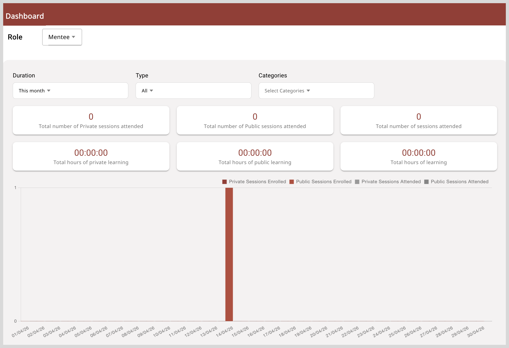
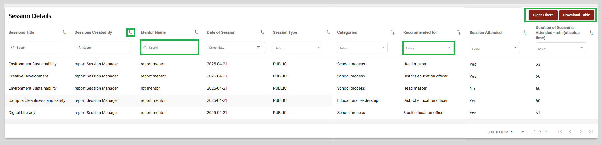

import DashboardIcon from './media/dashboard-icon.png';
import BurgerMenu from './media/burgermenu-icon.png'
import PortalApplicationMenu from './media/portal-menteeapplicationmenu.png'
import PortalMenteeDashboard from './media/portal-menteedashboard.png'
import Admonition from '@theme/Admonition';

# Dashboard for Mentees

The Dashboard provides a summary of the number of sessions attended by the mentee.

**To view the Dashboard, do as follows:**

<ol>
<li>To view the Dashboard page, do any one of the following actions:</li>
</ol>
<ul>
    <li>On <b>desktop</b>: Select <b>Dashboard</b> from the left panel.</li>

    

    <li>On <b>mobile</b>: Go to the application and click the <b>Dashboard</b> tab located at the bottom of the screen.</li>

</ul>

    

The mentee dashboard helps to track the total number of sessions attended by the mentees and also the total time spent for learning activities.

The dashboard provides a summary of the following:

* Total number of private sessions attended by the mentees.
* Total number of public sessions attended by the mentees.
* Total hours spent on learning sessions.

The bar chart shows the total number of mentees enrolled for the session and total number of sessions attended by the mentees.

Use the following options to filter the data suiting to your needs.

<table>
<tr>
    <th>Filter Options</th>
    <th>Description</th>
</tr>
<tr>
    <td>Duration</td>
    <td><ul><li><b>This week</b>: To view the mentoring sessions attended in the current week.</li>
    <li><b>This month</b>: To view the mentoring sessions attended by the mentees in the current month.</li>
    <li><b>This quarter</b>: To view the mentoring sessions attended in the current quarter.</li>
</ul></td>
</tr>
<tr>
    <td>Type</td>
    <td><ul><li><b>All</b>: Shows all the public and private sessions attended by the mentees for the selected duration.</li>
    <li><b>Public</b>: Shows only public sessions.</li>
    <li><b>Private</b>: Shows only private sessions.</li>
    </ul></td>
</tr>
<tr>
    <td>Categories</td>
    <td><ul><li>Select the appropriate category from the dropdown.</li></ul></td>
</tr>
</table>

## Session Details

You can view the session details, such as **Sessions Title**, **Sessions Created By**, **Mentor Name**, **Date of Session**, **Session Type**,
**Categories**, **Recommended for**, **Session Attended**, and **Duration of Sessions Attended**.

From the **Session Details** section you can perform the following actions:

1. **Sort**: Sort the table data  in ascending or descending order using the icon.

2. **Search**: To perform a quick search, type one or more letters in the search boxes provided. The search results appear based on the search term you typed.

3. **Select dropdown list**: Choose an appropriate value from the dropdown list to display the result that you require.
For example, to display only the public mentoring sessions, select **PUBLIC** from the **Session Type** dropdown list.

4. **Filter**: **Clear Filters** option appears only after you enter a search criteria in the search boxes provided. 
           To clear the filter applied, click **Clear Filters**.

5. **Download Table**: Click **Download Table** to download the table data as a CSV file. 

<Admonition type="info">
    
Only the data for the current month is displayed in the <b>Session Details</b> table.

    </Admonition>

## Download Table

**To download the table data, do as follows**:

1. Click **Download Table**. A pop-up window appears that allows you to select the time period.

2. Select the start date and the end date using the calendar icon.

3. Click **Submit** to download the session details as a CSV file for the selected time period.
