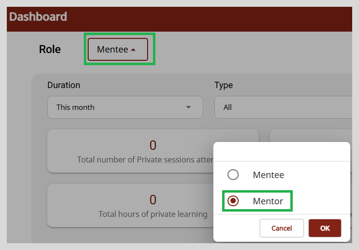
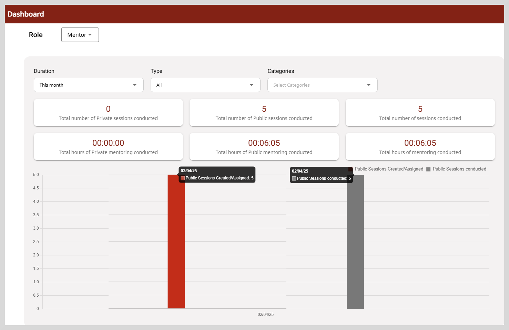
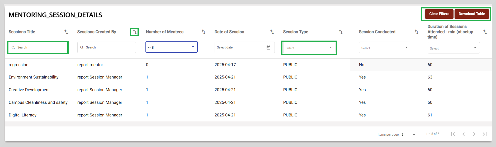
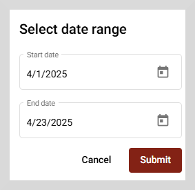

import DashboardIcon from './media/dashboard-icon.png';
import BurgerMenu from './media/burgermenu-icon.png'
import PortalApplicationMenu from './media/portal-mentorapplicationmenu.png'
import PortalMentorDashboard from './media/portal-mentordashboard.png'
import Admonition from '@theme/Admonition';

# Dashboard for Mentors

The Dashboard provides a summary of the number of sessions conducted and attended by the mentor.

**To view the Dashboard, do as follows:**

<ol>
<li>To view the Dashboard page, do any one of the following actions:</li>
<ul>
<li>Do one of the following actions:</li>
<ul>
<li>Select <b>Dashboard</b> from the <b>Application</b> menu.</li>
<li>Go to the <b>Application</b> menu  and select <b>Dashboard</b>.</li>
</ul>

    

<li>Go to the <b>Dashboard</b> tab.</li>

    

</ul>
</ol>

By default, the dashboard displays the mentoring session details for a mentee. You need to change the role to mentor.  To change to mentor, select the Mentor role from the **Role** dropdown.

The dashboard provides a summary of the following:

* Total number of public and private sessions created and conducted by the mentor.
* Total hours of public sessions and private sessions conducted.
* The bar graph gives a quick comparison of the number of sessions created or assigned and the number of sessions conducted.

Use the following options to filter the data suiting to your needs.

<table>
<tr>
    <th>Filter Options</th>
    <th>Description</th>
</tr>
<tr>
    <td>Duration</td>
    <td><ul><li><b>This week</b>: To view the number of public or private sessions conducted in the current week.</li>
    <li><b>This month</b>: To view the number of public or private sessions conducted in the current month.</li>
    <li><b>This quarter</b>: To view the number of public or private sessions conducted in the current quarter.</li>
</ul></td>
</tr>
<tr>
    <td>Type</td>
    <td><ul><li><b>All</b>: Shows all the public and private sessions hosted for the selected duration.</li>
    <li><b>Public</b>: Shows only public sessions.</li>
    <li><b>Private</b>: Shows only private sessions.</li>
    </ul></td>
</tr>
<tr>
    <td>Categories</td>
    <td><ul><li>Select the appropriate category from the dropdown.</li></ul></td>
</tr>
</table>

## Mentoring Session Details

You can view the mentoring session details, such as **Sessions Title**, **Sessions Created By**, **Number of Mentees**,
**Date of Session**, **Session Type**, **Session Conducted**, and **Duration of Sessions Attended**.

From this section you can perform the following actions:

1. **Sort**: Sort the table data  in ascending or descending order using the icon

2. **Search**: To perform a quick search, type one or more letters in the search boxes provided. The search results appear based on the search term you typed.

3. **Select dropdown list**: Choose an appropriate value from the dropdown list to display the result that you require.
For example, to display only the public mentoring sessions, select **PUBLIC** from the **Session Type** dropdown list.

4. **Filter**: **Clear Filters** option appears only after you enter a search criteria in the search boxes provided. 
           To clear the filter applied, click **Clear Filters**.

5. **Download Table**: Click **Download Table** to download the table data as a CSV file for the selected duration.

<Admonition type="info">
    
Only the data for the current month is displayed in the <b>Mentoring Session Details</b> table.

    </Admonition>

## Download Table

**To download the table data, do as follows**:

1. Click **Download Table**. A pop-up window appears that allows you to select the time period.

2. Select the start date and the end date using the calendar icon.

3. Click **Submit** to download the data as a CSV file for the selected time period.

