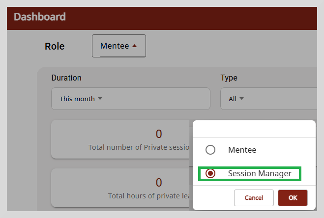
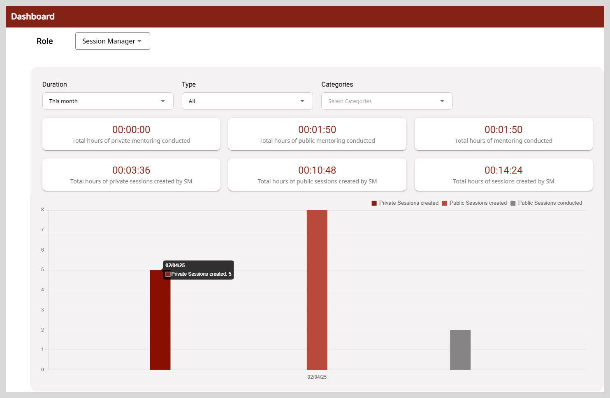
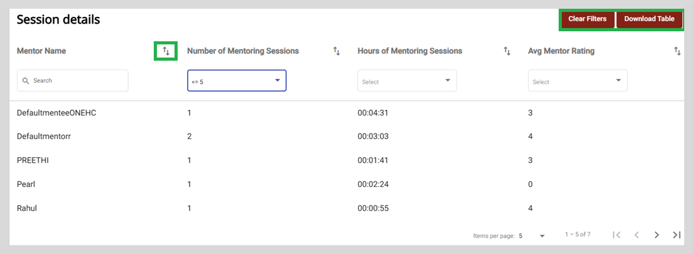

import DashboardIcon from './media/dashboard-icon.png';
import BurgerMenu from './media/burgermenu-icon.png'
import PortalApplicationMenu from './media/portal-menteeapplicationmenu.png'
import PortalMenteeDashboard from './media/portal-menteedashboard.png'
import SessionManagerMenu from './media/sessionmanagerpage.png'
import Admonition from '@theme/Admonition';

# Dashboard for Session Managers

The Dashboard gives you a summary of the total number of sessions hosted, total hours taken for the mentoring activity,
and the mentor rating received for the sessions conducted.

**To view the Dashboard, do as follows:**

<ol>
<li>To view the Dashboard page, do any one of the following actions:</li>
<ul>
<li>Do one of the following actions:</li>
    <ul>
    <li>Select <b>Dashboard</b> from the left panel.</li>
    <li>Go to the left panel  and select <b>Dashboard</b>.</li>
    </ul>

    

<li>Go to the <b>Dashboard</b> tab.</li>

    

</ul>
</ol>

By default, the dashboard displays the mentoring session details for a mentee. You need to change the role to session manager.
To change to session manager, select the **Session Manager** role from the **Role** dropdown.

  

The dashboard provides a summary of the following:

* Total number of public and private sessions created.
* Total number of public and private sessions successfully conducted.
* Total hours spent by session managers on session creation.
* Total mentoring hours, and average rating.

    

     <Admonition type="tip">
    
Hover over the bar graph to see the number of public and private sessions created/conducted.

    </Admonition>

Use the following options to filter the data suiting to your needs. 

<table>
<tr>
    <th>Filter Options</th>
    <th>Description</th>
</tr>
<tr>
    <td>Duration</td>
    <td><ul><li><b>This week</b>: To view the sessions created and conducted in the current week.</li>
    <li><b>This month</b>: To view the sessions created and conducted in the current month.</li>
    <li><b>This quarter</b>: To view the sessions created and conducted in the current quarter.</li>
</ul></td>
</tr>
<tr>
    <td>Type</td>
    <td><ul><li><b>All</b>: Shows all the public and private mentoring sessions hosted for the selected duration.</li>
    <li><b>Public</b>: Shows only public sessions.</li>
    <li><b>Private</b>: Shows only private sessions.</li>
    </ul></td>
</tr>
<tr>
    <td>Categories</td>
    <td><ul><li>Select the appropriate category from the dropdown.</li></ul></td>
</tr>
</table>

## Session Details

You can view the mentor's details, such as the name of the mentor, the number of mentoring sessions conducted, the time spent for the mentoring sessions in hours, and the rating received for the sessions.

From this section you can perform the following actions:

1. **Sort**: Sort the table data in ascending or descending order using the icon.

2. **Search**:  To perform a quick search, type one or more letters in the search boxes provided. The search results appear based on the search term you typed.

3. **Select dropdowns**: Choose an appropriate value from the select dropdown list to display the result that you require. For example, select a relevant value from
 the **Number of Mentoring Sessions** dropdown, to list the number of sessions conducted by a mentor.

   

4. **Filter**: **Clear Filters** option appears only after you enter a search criteria in the search boxes provided. 
           To clear the filter applied, click **Clear Filters**.

5. **Download Table**: Click **Download Table** to download the table data as a CSV file. 

  <Admonition type="info">
    
Only the data for the current month is displayed in the <b>Session details</b> table.

    </Admonition>

## Download Table

**To download the session details, do as follows**:

1. Click **Download Table**. A pop-up window appears that allows you to select the time period.

2. Select the start date and the end date using the calendar icon.

3. Click **Submit** to download the table data as a CSV file for the selected time period.