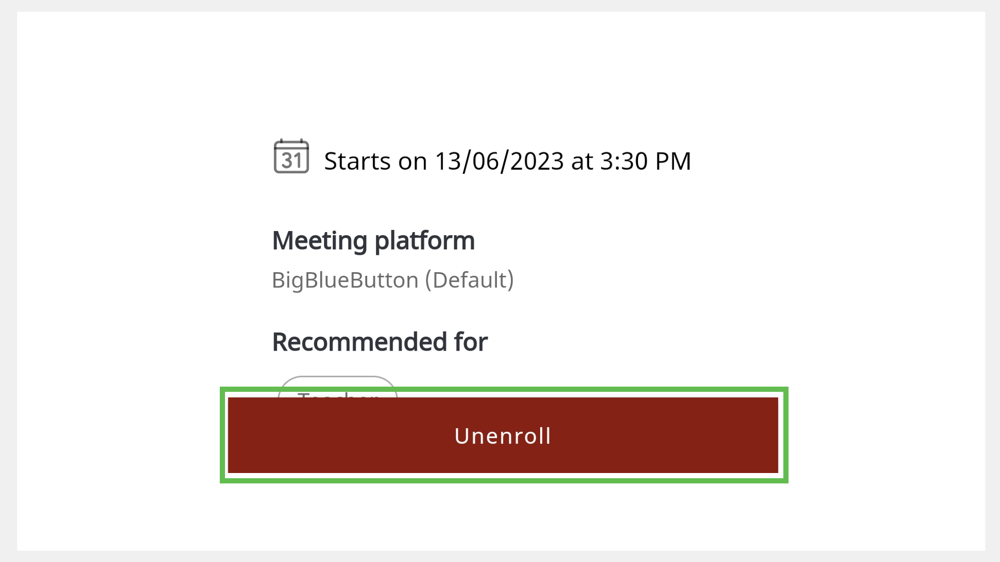

# Enrolling for a MentorED Session

Users can sign up for mentoring sessions.

>:::note
>Users can enroll for an ongoing session. These sessions are marked as *Live* on the Home page. 

1.	To enroll for a session, do any one of the following actions:

* On your Home page, find a session of interest. Tap the session tile and tap **Enroll**.

     

    
 

* In the search bar, select the **All Sessions** tab, type the session name, and tap **Search**. Tap the session tile and tap **Enroll**.

  
    

2.  To cancel your enrollment, tap **Cancel**. You can also go to **My Sessions** section on your Home page, tap the session, and tap **Cancel**.

    

    

    > :::note 
    > You cannot cancel the session 10 minutes before the scheduled time.
