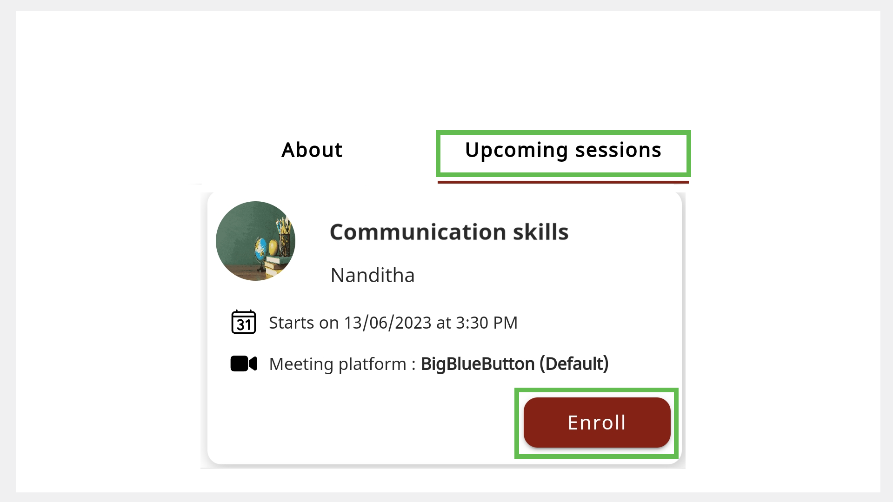

# Enrolling for a Session

You can explore and sign up for mentoring sessions.

>:::note
>You can enroll for an ongoing session, which appears as *Live* on the Home page.

You can enroll for a session in one of the following ways:
* Using the session tile
* Using the Session Details page
* Using the **Search** bar 
* Using the mentor profile

## Using the Session Tile

1. On the Home page, go to the **All sessions** tab. 

2. Find a session of interest and tap **Enroll**.

     

## Using the Session Details Page

1. On the Home page, go to the **All sessions** tab.

2. Tap the session tile to view the Session Details page.

3. Tap **Enroll**.

    
 
## Using the Search Bar

1. In the **Search** bar of the Home page, tap the **All Sessions** tab.

    

2. Type the session name and tap the **Search** button. 

3. Tap **Enroll**.

    >:::tip
    >To view the Session Details page before enrolling, tap the session tile and tap **Enroll**.

## Using the Mentor Profile

>:::info
>To learn more about accessing the mentor profile, see any one of the following sections:
>* [Mentor Directory](mentor-directory.md)
>* [Using a Shared Link to View a Mentor Profile](viewing-a-mentorprofile-using-a-sharedlink.md)

1.	On the Mentor Profile page, go to the **Upcoming sessions** tab.

2.	Tap **Enroll**. 

    

    >:::tip
    >To view the Session Details page before enrolling, tap the session tile and tap **Enroll**.
   
## Cancelling Your Enrollment

> :::note 
> You can cancel your enrollment if the mentor has not started the session.

1.	On your Home page, go to the **Enrolled sessions** tab.

2. Tap the session tile.

3. Tap **Cancel**.

    

