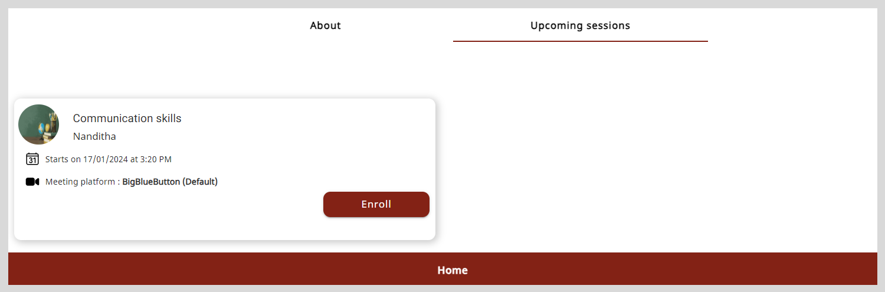
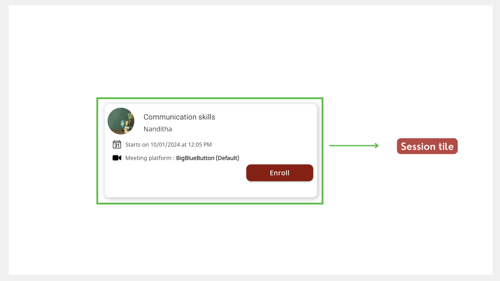
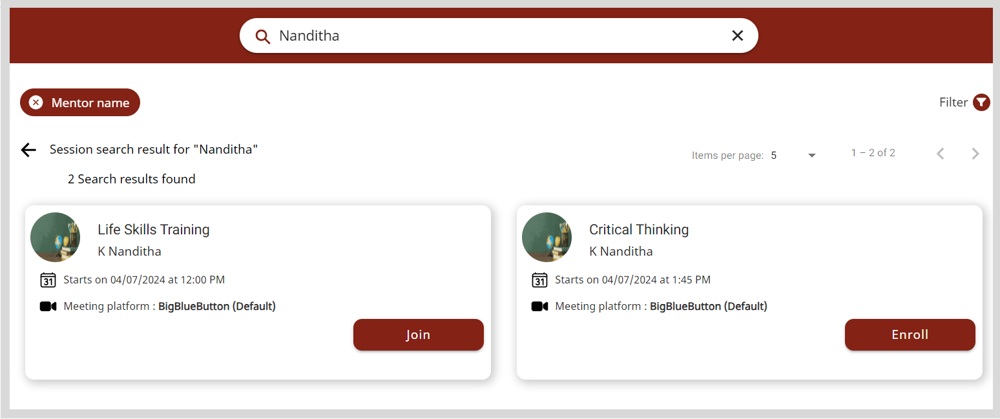

import PartialExample from './_mentored.mdx';
import PortalSearchSessions from './media/portal-searchsessions.png'
import PortalMentorProfileEnroll from './media/portal-mentorprofileenroll.png'
import PortalEnrollButton from './media/portal-enrollbutton.png'
import PortalSessionTileEnroll from './media/portal-sessiontileenroll.png'
import PortalSessionDetailsEnroll from './media/portal-sessiondetailsenroll.png'
import PortalCancelEnrollment from './media/portal-cancelenrollment.png'
import Admonition from '@theme/Admonition';

# Enrolling for a Session

You can explore Public sessions on <PartialExample mentored /> and sign up for sessions in your chosen domain or by a mentor of your choice.

<Admonition type="note">
<ul>
<li>If a session manager invites you to a Public or Private session, you are automatically enrolled to the session.</li>
<li>You cannot enroll for a session after the enrollment limit is reached. If you try to enroll after this limit is reached, a <i>Session seats full</i> message appears.</li>
<li>You can enroll for an ongoing session, which appears as <i>Live</i> on the Home page.</li>
</ul>
</Admonition>

You can enroll for Public sessions in one of the following ways:

* Using the **All sessions** tab
* Using the mentor profile
* Using the Session details page
* Using the **Search** box

## Using the All Sessions Tab

1. On the Home page, go to the **All sessions** tab.

2. Find a session of interest and click **Enroll**. The enrolled sessions are listed on the **Enrolled sessions** tab of the Home page.

    

## Using the Mentor Profile

<Admonition type="info">

See <a href="mentor-directory">Mentor Directory</a> to learn more about accessing the mentor profile.

</Admonition>

**To enroll for a session using the mentor profile, do as follows:**

1. On the Mentor Profile page, go to the **Upcoming sessions** tab.

2. Click **Enroll**. The enrolled sessions are listed on the **Enrolled sessions** tab of the Home page.

    

## Using the Session Details Page

1. Find a session from the **All sessions** tab or the Mentor Profile page.

2. Click the session tile to view the Session Details page.

    

3. Click **Enroll**. The enrolled sessions are listed on the **Enrolled sessions** tab of the Home page.

    

## Using the Search Box

1. To find upcoming sessions, enter a search phrase such as the session title or mentor's name in the **Search** box and press **Enter**. The search results appear as session tiles. 

    

    
You can also search for sessions based on a specific category. Click here for the following actions:

    1. Specify the search category using the following methods:

        <table>
        <tr>
            <th>Category</th>
            <th>Actions</th>
        </tr>
        <tr>
            <td>Search Category</td>
            <td>Click the <b>Search</b> box and select a search category such as <b>Mentor name</b>.</td>
        </tr>
        <tr>
            <td>Filter</td>
            <td><ol><li>Click on <b>Filter</b>.</li><li>Select one or more filters and click <b>Apply</b>.</li>
<Admonition type="tip">
To clear filters, do one of the following actions:
<ul><li>Clear the filter checkbox.</li><li>Click <b>Clear all</b> to clear all the applied filters.</li></ul></Admonition>
</ol></td>
        </tr>
        </table>
    
    2. Enter the search phrase. Based on the specified search category, the search results appear as session tiles.

        

    

    

    <Admonition type="tip">
    
If there are multiple search results, you can find the respective session using the following ways:

    <ul>
    <li>Viewing the search results on different pages by clicking the <b>Next</b> or <b>Previous</b> buttons.</li>
    <li>Changing the number of search results listed on the page using the <b>Items per page</b> dropdown.</li>
    <li>Applying filters. To learn more, refer to the category-based search instructions in step 1.</li>
    </ul>
    </Admonition>
    

2. Click **Enroll**. The enrolled sessions are listed on the **Enrolled sessions** tab of the Home page.

## Cancelling Your Enrollment

<Admonition type="note">
<ul>
<li>If you were invited to a session, you cannot cancel your enrollment for the session.</li>
<li>You can cancel your enrollment if the mentor has not started the session.</li>
</ul>
</Admonition>

**To cancel your enrollment, do as follows:**

1. On your Home page, go to the **Enrolled sessions** tab.

2. Click the session tile.

3. Click **Unenroll**.

    

4. Click **Unenroll** on the confirmation dialog. The session is removed from the **Enrolled sessions** tab of the Home page.