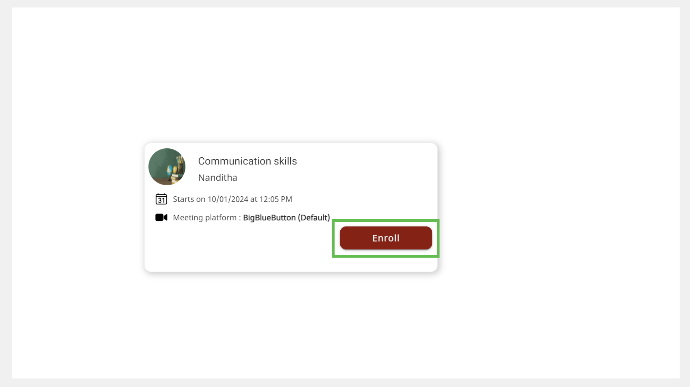

import PartialExample from './_mentored.mdx';
import Admonition from '@theme/Admonition';
import SearchSession from './_searchsession.mdx';

# Enrolling for a Session

You can explore Public sessions on <PartialExample mentored /> and sign up for sessions in your chosen domain or by a mentor of your choice.

<Admonition type="note">
<ul>
<li>If a session manager invites you to a Public or Private session, you are automatically enrolled to the session.</li>
<li>You cannot enroll for a session after the enrollment limit is reached. If you try to enroll after this limit is reached, a <i>Session seats full</i> message appears.</li>
<li>You can enroll for an ongoing session, which appears as <i>Live</i> on the Home page.</li>
</ul>
</Admonition>

You can enroll for Public sessions in one of the following ways:

* Using the **All sessions** tab
* Using the mentor profile
* Using the Session details page
* Using the **Search** box

## Using the All Sessions Tab

1. On the Home page, go to the **All sessions** tab.

2. Find a session of interest and click **Enroll**. The enrolled sessions are listed on the **Enrolled sessions** tab of the Home page.

    

## Using the Mentor Profile

<Admonition type="info">

See <a href="mentor-directory">Mentor Directory</a> to learn more about accessing the mentor profile.

</Admonition>

**To enroll for a session using the mentor profile, do as follows:**

1. On the Mentor Profile page, go to the **Upcoming sessions** tab.

2. Click **Enroll**. The enrolled sessions are listed on the **Enrolled sessions** tab of the Home page.

    

## Using the Session Details Page

1. Find a session from the **All sessions** tab or the Mentor Profile page.

2. Click the session tile to view the Session Details page.

    

3. Click **Enroll**. The enrolled sessions are listed on the **Enrolled sessions** tab of the Home page.

    

## Using the Search Box

1. <SearchSession />
2. Click **Enroll**. The enrolled sessions are listed on the <b>Enrolled sessions</b> tab of the Home page.

## Cancelling Your Enrollment

<Admonition type="note">
<ul>
<li>If you were invited to a session, you cannot cancel your enrollment for the session.</li>
<li>You can cancel your enrollment if the mentor has not started the session.</li>
</ul>
</Admonition>

**To cancel your enrollment, do as follows:**

1. On your Home page, go to the **Enrolled sessions** tab.

2. Click the session tile.

3. Click **Unenroll**.

    

4. Click **Unenroll** on the confirmation dialog. The session is removed from the **Enrolled sessions** tab of the Home page.