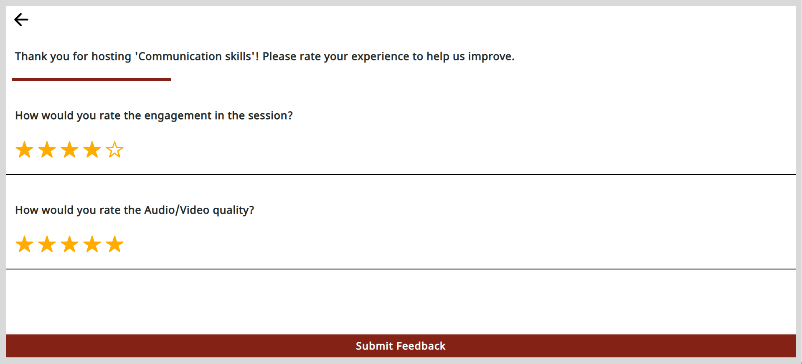

import PartialExample from './_mentored.mdx';

# Providing Session Feedback as a Mentor

At the end of the session, the mentor can share feedback by providing a rating for the following:

* Session interaction
* Quality of online interaction

**To provide a feedback, do as follows:**

1. After the session, go to <PartialExample mentored />.

2. Enter the ratings and tap <b>Submit Feedback</b>. The feedback is recorded.

   

