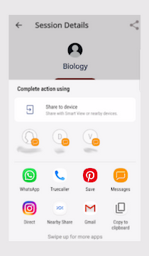

# Sharing Session Invites to Your Contacts
You can invite participants to a session by sharing a session link.

You can share a session link in one of the following ways:
* Using the **All sessions** tab
* Using the **Enrolled sessions** tab

## Using the All Sessions Tab
1. On the Home page, go to the **All sessions** tab.

2. Find an upcoming session. 

3. Tap the session tile and tap **Share** .

   

3. Share the session link with your contacts or on social media.

## Using the Enrolled Sessions Tab

1. On the Home page, go to the **Enrolled sessions** tab.

2. Find an enrolled session. Tap the session tile and tap **Share** .

   

3. Share the session link with your contacts or on social media.
