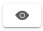

import Admonition from '@theme/Admonition';
import PartialExample from './_mentored.mdx';
import JoinStepPortal from './_joinsessionstep-portal.mdx';
import ViewSessionList from './media/sessionlist-view.png';

# Joining Sessions that Are Assigned to Mentors

You can join sessions that you have assigned to mentors:

* If it is a session of interest.
* To monitor the session and make the necessary changes to the session such as changing the meeting information.

## Enrolling for the Session

Before joining, you must enroll for the session.

  
    <Admonition type="tip">
    
If you enroll for the session, the session enrollment limit remains unaffected. Therefore, you can join the session even if the session seats are filled by other mentee enrollments.

    </Admonition>

**To enroll for a Public or Private session, do as follows:**

1. Do one of the following actions:

    * Select <b>Workspace</b> from the <b>Application</b> menu.

    * Go to the <b>Application</b> menu  and select <b>Workspace</b>.

2. Click **Manage sessions**. The Session list section appears.

3. Find the session and click . The Session Details page appears.

4. Click **Enroll**.

   
  
    <Admonition type="tip">
    
After enrolling for the session:

    <ul>
    <li>On the session details page, the <b>Mentee count</b> value remains unchanged and your name is listed on the Mentee list window. See <a href="manageassignedsession#tracking-the-enrollments">Tracking the Enrollments</a> to learn more.</li>
    <li>The session is listed on the <b>Enrolled sessions</b> tab of the Home page.</li>
    </ul>
    </Admonition>
    

    

  
<Admonition type="info">

For alternative methods of enrolling for a Public session, see <a href="enrolling-for-a-session">Enrolling for a Session</a>.

</Admonition>

### Cancelling the Enrollment

**To cancel your enrollment a Public or Private session, do as follows:**

1. On the Session list section, find the enrolled session and click .

2. On the Session Details page, click **Unenroll**.

3. Click **Unenroll** on the confirmation dialog.

  
<Admonition type="info">

To cancel your enrollment for a Public session using the <b>Enrolled sessions</b> tab, see <a href="enrolling-for-a-session#cancelling-your-enrollment">Cancelling Your Enrollment</a>.

</Admonition>

## Joining Sessions

**To join sessions, do as follows:**
<ol>
<li>On the Session list section, find the enrolled session and click .</li>
<li>On the Session Details page, click <b>Join</b>.</li>
<JoinStepPortal />
</ol>

  
<Admonition type="info">

For alternative methods of joining sessions, see <a href="joining-a-session">Joining a Session</a>.

</Admonition>

