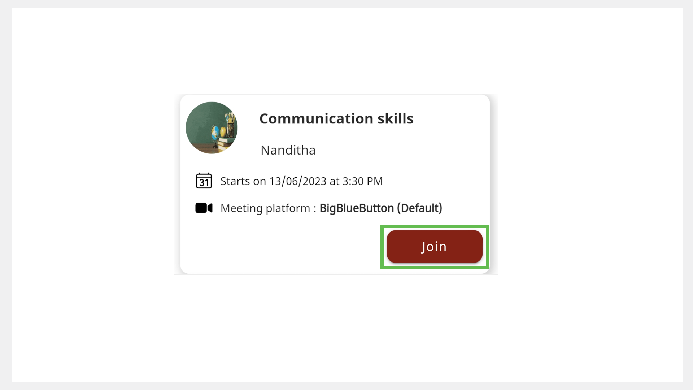
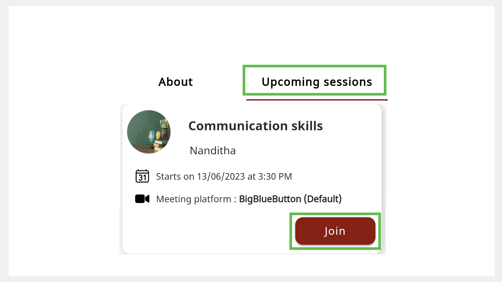

import PartialExample from './_mentored.mdx';

# Joining a Session

<PartialExample mentored /> application is integrated with BigBlueButton to enable the hosting of mentoring sessions.

> :::note  
> * You must enroll before joining a session. 
> * You can only join when the mentor starts the session.
> * You can join the session anytime within the time allocated for the session.

You can join a session in one of the following ways:

* Using the **Enrolled sessions** tab
* Using the **All sessions** tab
* Using the **Search** bar
* Using the mentor profile

## Using the Enrolled Sessions Tab

1. On the Home page, go to the **Enrolled sessions** tab.

2. Find the session and tap **Join**. 

    >:::tip
    >* To view the Session Details page before joining, tap the session tile and tap **Join**.
    >* If an error occurs, go back to <PartialExample mentored /> and tap **Join**.

    

## Using the All Sessions Tab
    
1. On the Home page, go to the **All Sessions** tab. 

2. Find an enrolled session and tap **Join**.
  
    

## Using the Search bar

1. Tap the **All Sessions** tab.

    

2. Type the session name and tap the **Search** button. 

3. Tap **Join**.

    >:::tip
    >To view the Session Details page before joining, tap the session tile and tap **Join**.

## Using the Mentor Profile

>:::info
>To learn more about accessing the mentor profile, see any one of the following sections:
> * [Mentor Directory](mentor-directory.md)
> * [Using a Shared Link to View a Mentor Profile](viewing-a-mentorprofile-using-a-sharedlink.md)

1.	On the Mentor Profile page, go to the **Upcoming sessions** tab.

2.	Tap **Join**. 

    

    >:::tip
    >To view the Session Details page before joining, tap the session tile and tap **Join**.

##  Configuring the BigBlueButton Settings

The BigBlueButton meeting window appears on your web browser.

### Configuring the Microphone

1.  To select the audio settings, do any one of the following actions:

    * To connect your microphone, tap the **Microphone** option and select **Yes**. 

      > :::note  
      > Microphone may turn on by default.

    * To join without connecting your microphone, tap the **Listen only** option.

2.	To mute your microphone, tap the **Microphone** button. Tap again to unmute it.

### Configuring the Webcam 

1. To turn on the webcam, tap the **Webcam** button.

2. Tap **Start sharing**. Before turning on your webcam, you can change the webcam (you can use either your front or rear camera of your phone) and background. 

    > :::note  
    >* The webcam may turn on by default. 
    >* To change your webcam and background, tap the **Webcam** button, make changes, and close the window.

3. To turn it off, tap the **Webcam** button and tap **Stop sharing**.

### Checking the Quality of Your Internet Connection 

The **Connection status** icon located on the top portion of the window indicates the quality of your internet connection.

### Leaving the Session

To leave the meeting, go to the **Options** menu and select **Leave meeting**.

  > :::note  
  > If you leave the meeting unintentionally (by pressing the back key on your phone or closing the meeting tab), go back to <PartialExample mentored /> and tap **Join**. 

### Best Practices

- Unmute your [microphone](#configuring-the-microphone) only when necessary.

- Maintain a neat background and attire before you turn on your [webcam](#configuring-the-webcam). 

- Use respectful language while sharing any information. Discuss only mentoring-related topics.

- Tap the **Raise hand** button to ask a question.

## Using BigBlueButton Features

The BigBlueButton application provides more features which are as follows:

* Managing meeting settings
* Adding user status
* Sending chat messages
* Sharing notes
* Using the whiteboard
* Polling
* Joining breakout rooms

>:::info
>To learn more, see [BigBlueButton Help](https://bigbluebutton.org/teachers/tutorials/).