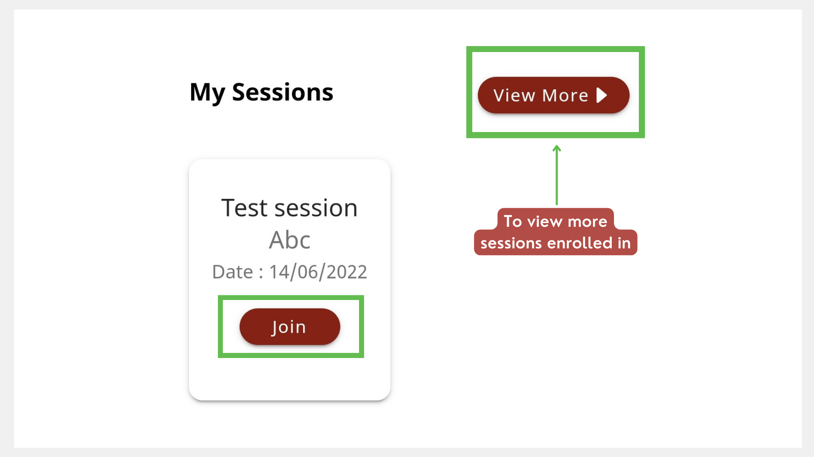
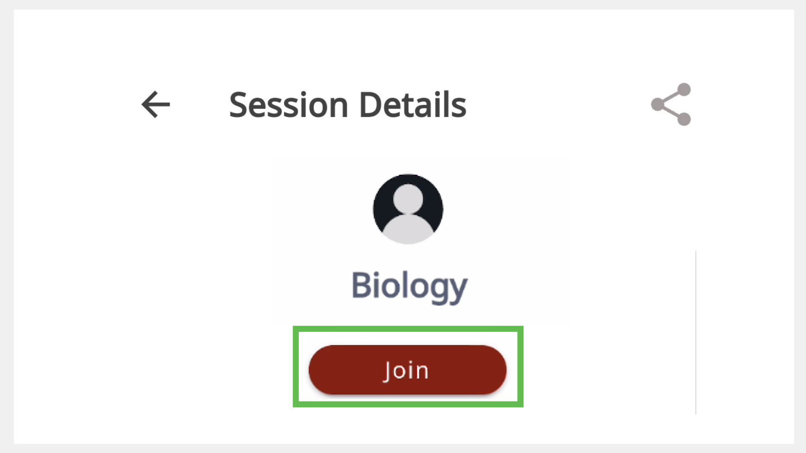

import PartialExample from './_mentored.mdx';

# Joining a Session

<PartialExample mentored /> application is integrated with BigBlueButton to enable the hosting of mentoring sessions.

> :::note  
> * You must enroll before joining a session. 
> * You can only join when the mentor starts the session.
> * You can join the session anytime within the time allocated for the session.

You can join a session in one of the following ways:

* Using **My Sessions** section
* Using **All Sessions** section

## Using My Sessions Section
1. On the Home page, go to **My Sessions**.

2. Select the session and tap **Join**. To view the session details before joining, tap the session tile.

  >:::tip 
  >If an error occurs, go back to <PartialExample mentored /> and tap **Join**.

  

## Using All Sessions Section
    
1. On the Home page, select a session from the **All Sessions** section. 

2. Tap the session tile and tap **Join**.
  
  

##  Configuring the BigBlueButton Settings
The BigBlueButton meeting window appears on your web browser.

### Configuring the Microphone

1.  To select the audio settings, do any one of the following actions:

    * To connect your microphone, tap the **Microphone** option and select **Yes**. 

      > :::note  
      > Microphone may turn on by default.

    * To join without connecting your microphone, tap the **Listen Only** option.

2.	To mute your microphone, tap the **Microphone** button. Tap again to unmute it.

### Configuring the Webcam 

1. To turn on the webcam, tap the **Webcam** button.

2. Tap **Start Sharing**. Before turning on your webcam, you can change the webcam (you can use either your front or rear camera of your phone) and background. 

    > :::note  
    >* The webcam may turn on by default. 
    >* To change your webcam and background, tap the **Webcam** button, make changes, and close the window.

3. To turn it off, tap the **Webcam** button and tap **Stop Sharing**.

### Checking the Quality of Your Internet Connection 

The **Connection Status** icon located on the top portion of the window indicates the quality of your internet connection.

### Leaving the Session

To leave the meeting, go to the **Options** menu and select **Leave Meeting**.

  > :::note  
  > If you leave the meeting unintentionally (by pressing the back key on your phone or closing the meeting tab), go back to <PartialExample mentored /> and tap **Join**. 

### Best Practices

- Unmute your [microphone](#configuring-the-microphone) only when necessary.

- Maintain a neat background and attire before you turn on your [webcam](#configuring-the-webcam). 

- Use respectful language while sharing any information. Discuss only mentoring-related topics.

- Tap the **Raise Hand** button to ask a question.

## Using BigBlueButton Features

The BigBlueButton application provides more features which are as follows:

* Managing meeting settings
* Adding user status
* Sending chat messages
* Sharing notes
* Using the whiteboard
* Polling
* Joining breakout rooms

>:::info
>To learn more, see [BigBlueButton Help](https://bigbluebutton.org/teachers/tutorials/).