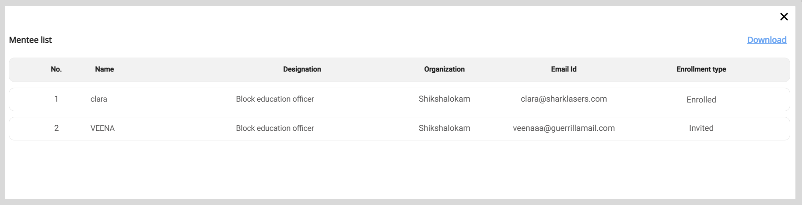

import Admonition from '@theme/Admonition';

# Managing the Assigned Sessions

On the Session list section, you can carry out the following session management activities for the assigned sessions:

* View the details such as session schedule, the number of mentee enrollments, and the type of session.
* Track the session progress. In the **Status** column, you can find the following session statuses:
    * Upcoming: The mentor is yet to host the session.
    * Live: The mentor has started the session.
    * Completed: The mentor completed the session.
* Edit the session information.
* Delete the session assigned to mentors. 

To view the Session list section, do as follows:

1. Do one of the following actions:

    * Select <b>Workspace</b> from the <b>Application</b> menu.

    * Go to the <b>Application</b> menu  and select <b>Workspace</b>.

2. Click **Manage sessions**. The Session list section appears.

    

    <Admonition type="tip">
    
From the list, you can find sessions by:
        <ul>
        <li>Using filters such as the status or type of session.</li>
        <li>Changing the number of sessions listed on the page using the <b>Items per page</b> dropdown.</li>
        </ul>
    

    
To download the list, click the <b>Download</b> link.

    </Admonition>
    

    

## Viewing the Session Details

On the Session Details page, you can view:

* The session information such as schedule and meeting platform.
* The number of mentee enrollments.
* The list of mentees who enrolled for the session or were invited.

To view the session details page, click .

### Viewing the Mentee Enrollments

To view the list of mentee enrollments, click **View list**.

<Admonition type="tip">

To download the list, click the <b>Download</b> link.

</Admonition>

## Editing a Session

To view the Edit session details page, do one of the following actions:

* In the Session list section, click .

* On the session details page, click **Edit**.

### Editing the Session Details

<Admonition type="note">

You can edit the session details only until the mentor starts the session.

</Admonition>

1. On the Edit session details page, go to the <b>Edit session</b> tab.

2. Make the necessary changes to the session information.

3. To make changes to the mentee invitations, do any one of the following actions:

    * To invite new mentees, click **+ Add New Mentee** and add mentees from the list.
    * To remove invited mentees, click the mentee's name and click **Remove** on the Mentee list window.

3. To update your session image, click <b>Add image</b> and do one of the following actions:

    * To take a picture, select <b>Take Photo</b>.
    * To upload an image, select <b>Choose from library</b>.
    * To remove the existing image, select <b>Remove current photo</b>.

    
  
        <Admonition type="tip">
        
Select an image that is relevant to the session topic.

        </Admonition>
    

4. Click **Save**. The session details are updated.

### Editing the Meeting Information

<Admonition type="tip">

You can edit the meeting information even after the mentor has started the session.

</Admonition>

1. On the Edit Session Details page, go to the <b>Meeting link</b> tab and make the necessary changes.

2. Click <b>Submit</b>. The meeting information is updated.

## Deleting a Session

<Admonition type="note">

You can delete the session only until the mentor starts the session.

</Admonition>

**To delete the session, do as follows:**

1. To delete the session, do one of the following actions:

    * In the Session list section, click .

    * On the session details page, click **Delete**.

2. Click <b>Yes delete</b> on the confirmation dialog. The session is cancelled and is removed from the Session list section.