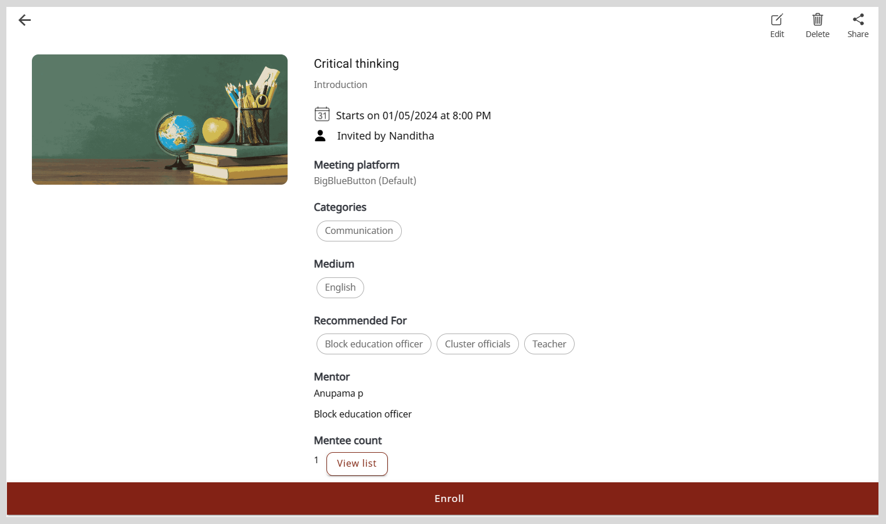

import Admonition from '@theme/Admonition';

# Managing Sessions That Are Assigned to Mentors

On the Session list section, you can carry out the following session management activities:

* View the details such as, the session's schedule, the number of enrollments, and the type of session.
* Track the session's progress using the following session statuses:
    * Upcoming: The mentor is yet to host the session.
    * Live: The mentor has started the session.
    * Completed: The mentor completed the session.
* Edit the session information.
* Delete the session. 

To view the Session list section, do as follows:

1. Do one of the following actions:

    * Select <b>Workspace</b> from the <b>Application</b> menu.

    * Go to the <b>Application</b> menu  and select <b>Workspace</b>.

2. Click **Manage sessions**. The Session list section appears.

    

    <Admonition type="tip">
    
From the list, you can find sessions by:
        <ul>
        <li>Using filters such as the status or type of session.</li>
        <li>Changing the number of sessions listed on the page using the <b>Items per page</b> dropdown.</li>
        </ul>
    

    
Click the <b>Download</b> link to download a CSV file of list.

    </Admonition>
    

    

## Tracking the Enrollments

### Viewing the Number of Enrollments

To view the number of enrollments on the Session list section, do any one of the following actions:

* View the Mentee count value.

    

* Click  and view the Mentee count value on the Session Details page.

    

### Viewing the List of Mentees

To view the list of mentees who have enrolled or who were invited to a session, do any one of the following actions:

* On the Session list section, find a session and click the Mentee count value. The Mentee list page appears.

    

* Do the following actions:
    
    1. Click . The Session Details page appears.

        

    2. Click **View list**. The Mentee list page appears. 

        

        <Admonition type="tip">
        
Click the <b>Download</b> link to download a CSV file of list.

        </Admonition>
        

        

## Viewing the Mentor Profile page

On the mentor Profile page, you can view a mentor's details such as the number of sessions hosted and their session ratings.

On the Session list section, click the mentor's name to view the Mentor Profile page.

## Editing a Session

To view the Edit session details page, do one of the following actions:

* In the Session list section, click .

* Do the following actions:

    1. On the Session list section, click . The Session Details page appears.

        

    2. Click **Edit**.

### Editing the Session Information

<Admonition type="note">

You can edit the session details only until the mentor starts the session.

</Admonition>

**To edit the session information, do as follows:**

1. On the Edit session details page, go to the <b>Edit session</b> tab.

2. Make the necessary changes to:

    * The session information.

    * The list of invited mentees. To update the list, do any one of the following actions:

        * To invite new mentees, click **+ Add New Mentee** and add mentees from the list.
        * To remove invited mentees, click the mentee's name and click **Remove** on the Mentee list window.

    * The session image. To update the session image click <b>Add image</b> and do one of the following actions:

        * To take a picture, select <b>Take Photo</b>.
        * To upload an image, select <b>Choose from library</b>.
        * To remove the existing image, select <b>Remove current photo</b>.

        
  
            <Admonition type="tip">
            
Select an image that is relevant to the session topic.

            </Admonition>
        

5. Click **Save**. The session details are updated.

### Editing the Meeting Information

<Admonition type="tip">

You can edit the meeting information even after the mentor has started the session.

</Admonition>

**To edit the meeting information, do as follows:**

1. On the Edit Session Details page, go to the <b>Meeting link</b> tab and make the necessary changes.

2. Click <b>Submit</b>. The meeting information is updated.

## Deleting a Session

<Admonition type="note">

You can delete the session only until the mentor starts the session.

</Admonition>

**To delete the session, do as follows:**

1. To delete the session, do one of the following actions:

    * In the Session list section, click .

    * Do the following actions:

        1. Click . The Session Details page appears.

            

        2. Click **Delete**.

2. Click <b>Yes delete</b> on the confirmation dialog. The session is cancelled and is removed from the Session list section.