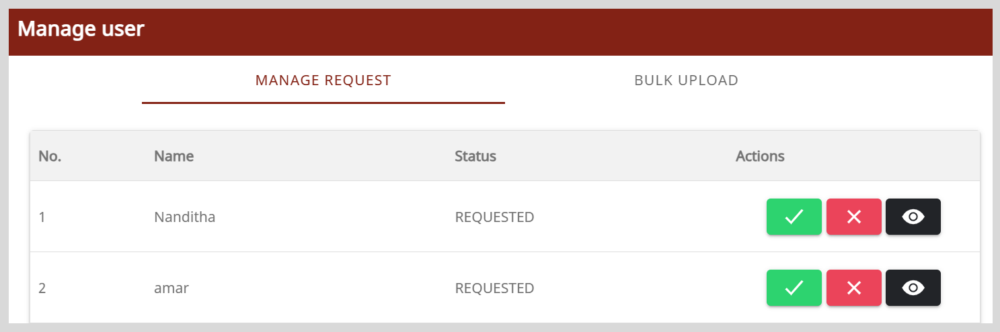

# Managing Requests to be a Mentor

After mentees raise request to be a mentor, organization administrator can review their profile details and accept or reject the request.

**To accept requests to be a mentor, do as follows:**

1. Go to the <b>Application</b> menu  and select **Admin Workspace**.

2. On the Admin Workspace page, click **Manage user**.

3. On the Manage Request tab, click **View**  to review the profile details.

    
    
4. Do one of the following actions:

    * To accept the request, do as follows:

        1. Click **Accept** .
        2. Click **Yes** in the confirmation dialog.

    * To reject the request, do as follows:

        1. Click **Reject** .
        2. Click **Yes** in the confirmation dialog.

