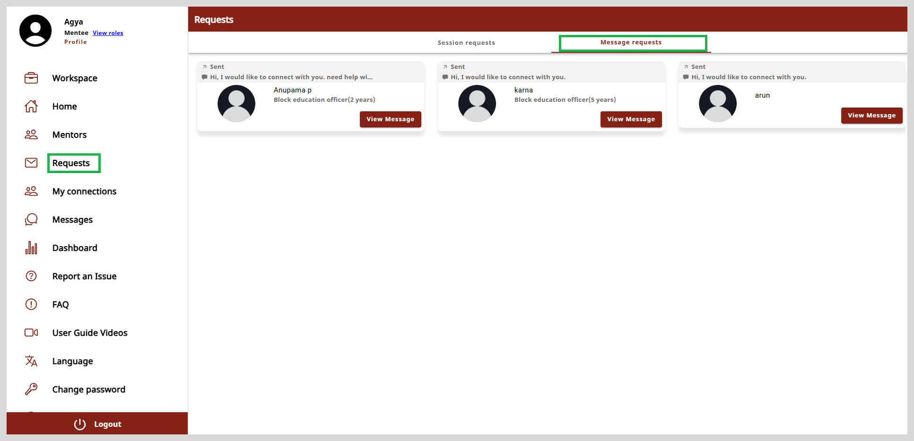
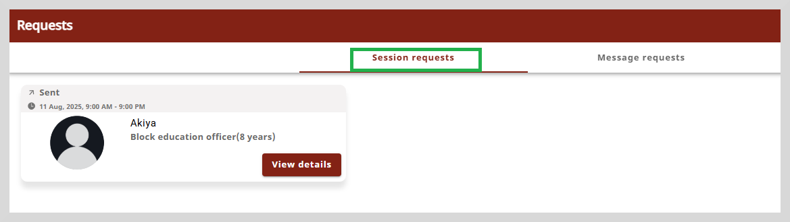
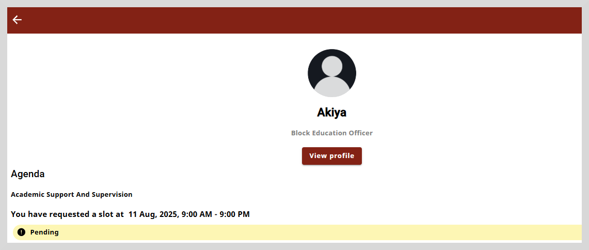

import Admonition from '@theme/Admonition';

# Message Requests

On the Request page you can do the following actions:

* View the message requests sent to the mentors whom you wish to connect with.

* View the session requests sent to the mentors.

To view the Message Requests, do any one of the following actions:

* Select **Requests** from the left panel. The Request page appears.

* Go to the left panel and select **Requests**.

The Request page contains two tabs: (1) Message requests (2) Session requests

## Message Requests

The Message requests tab will list all the message requests sent to the mentors' whom you wish to connect with.

 

* Click anywhere on the mentor's card to view their profile.

* Click **View Message** to open the chat window. Here, you can see the first message sent to the mentor.

 ## Session Requests

The Session requests tab lists all the session requests you have sent to the mentors.

You can view the session details and the mentor's profile. To view the session details, click **View details**

Click **View profile** to open the profile page.

 

