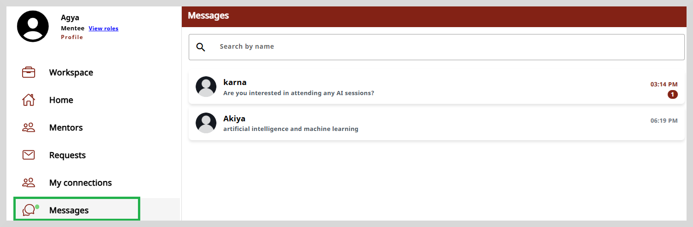
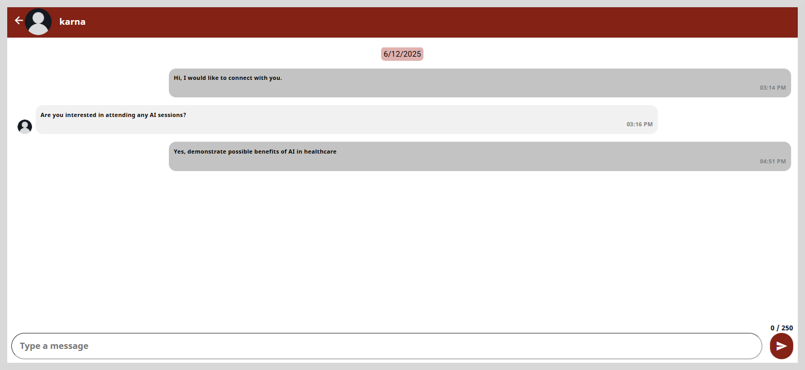

import Admonition from '@theme/Admonition';

# Viewing Chat Messages

Here, you can view all the chat messages you have sent or received from the mentor. By default, the most recent messages are displayed on the top of the page.

<Admonition type="tip">    

A green dot on the <b>Message</b> on the left panel indicates that you have received a new message.

</Admonition>

Select the row that corresponds to the mentor whose chat messages you wish to view.  The chat window appears.

 

 You can also send a message to the mentor using the text box provided at the bottom of the window.

 ## Search

 To search for a specific mentor, type three or more letters in the **Search by name** text box
 located on the top of the page. The search results appear based on the search term you have typed in the search box.

