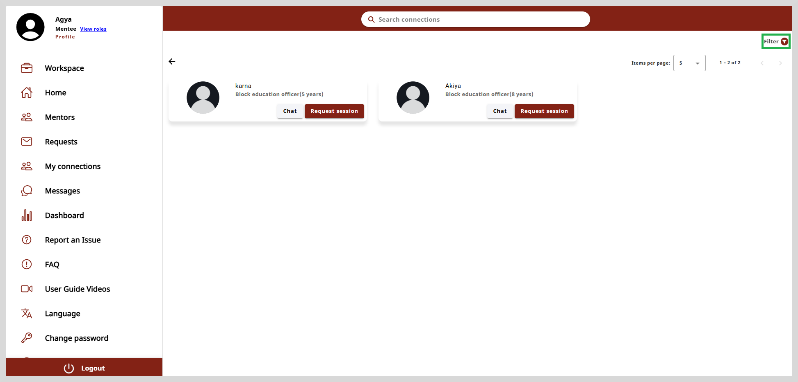

import Admonition from '@theme/Admonition';

# Managing Mentee Connections

On the My Connections page, you will see a list of mentors who have accepted your message requests or session requests. You can view their profiles and communicate with
them online.

The mentor's details are displayed as cards as shown in the following figure.
Each card displays the mentor's image, name, designation, and years of experience. You can chat with the mentor and also request
for a session using the **Chat** and **Request session** option available on the mentor's card.

## Working with Chat and Request Session

The **Chat** feature enables you to communicate with a mentor in real-time through text messages.

**To chat with the mentor, do as follows:**

1. Click **Chat** on the mentor's card to open the chat window.

2. Type your message in the space provided at the bottom of the page.

3. Click the send button to send your message.

 
**To request a session, do as follows:**

1. Click **Request session** on the mentor card.

2. Enter a **Title** for the session.

3. Select the **Start date** and the **End date** using the calendar icon.

4. Enter the **Agenda** for the session.

5. Click **Submit request**. A message appears stating that your request has been sent successfully.

## Finding Mentors Using the Search Connections

To find mentors on the my connections page, type the mentor's name or the area of expertise in the <b>Search connections</b> box. Type
three or more letters of the mentor's name or area of expertise and then press **Enter**. The search results appear as mentor cards.

## Filter

You can filter the search results using the **Filter** option located on the upper-right corner of the page.
You can use the criteria such as **Area of Expertise**, **Designation**, and **Organizations**.

**To apply a filter do as follows:**

1. Click the **Filter** option on the upper-right corner of the page.

2. Select the required criteria from the **Filter** dialog box.

3. Click **Apply** to apply the filter.

  <Admonition type="tip">
        
To clear filters, do one of the following actions:

        <ul>
        <li>Clear the specific filter checkbox.</li>
        <li>Click <b>Clear all</b> to clear all the applied filters.</li>
        </ul>
        </Admonition>

