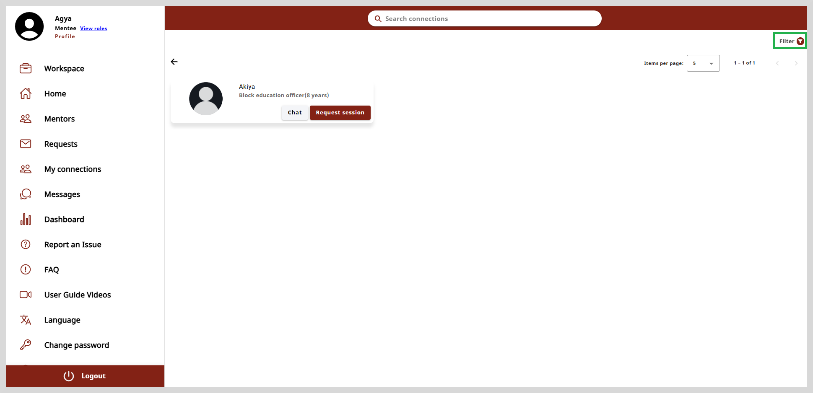
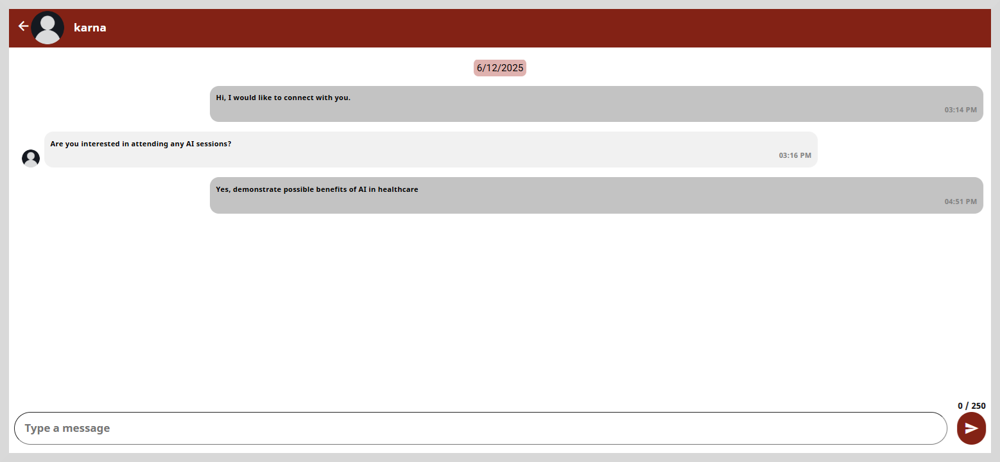
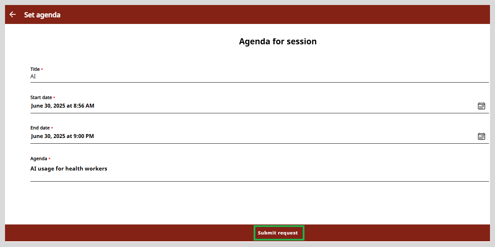
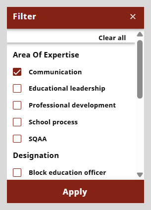

import Admonition from '@theme/Admonition';

# My Connections

This page lists the mentors or the session managers with whom you have connections. You can view and interact with
all the mentors you are connected to.

The mentor's details are displayed as cards as shown in the following figure.
Each card displays the mentor's image, name, designation, and years of experience. You can chat with the mentor and also request
for a session using the **Chat** and **Request session** option available on the mentor's card.

## Working with Chat and Request Session

The **Chat** feature enables you to communicate with a mentee or mentor in real-time through text messages.

**To chat with the mentor, do as follows:**

1. Click **chat** on the mentor's card to open the chat window.

2. Type your message in the space provided at the bottom of the page.

3. Click the send button to send your message.

 Mentee will be able to start the conversation through messages only  when the mentor accepts the request and 
 a connection is established.

<Admonition type="info">
    

    <ul>
   <li>The mentee can send only one message till your message request is accepted.</li>
    <li>The text message can contain letters, numbers, and special characters.</li>
    <li>The first message you send is limited to 160 characters. Subsequent messages can have a maximum of 255 characters.</li>    
    <li>A mentee cannot connect or chat with another mentee.</li>
      </ul> 
       

    </Admonition>

**To request a session, do as follows:**

1. Click **Request session** on the mentor card.

2. Enter a title for the session.

3. Set the the start date and the end date using the calendar icon.

4. Enter the agenda for the session.

5. Click **Submit request**. A message appears stating that your request has been sent successfully.

## Finding Mentors Using the Search Connections

To find mentors on the my connections page, type the mentor's name or the area of expertise in the Search connections box. Type
three or more letters and press **Enter**. The search results appear as mentor cards.

## Filter

You can filter the search results using the **Filter** option located on the upper-right corner of the page.
You can use the criteria such as **Area of Expertise**, **Designation**, and **Organizations**.

**To apply a filter do as follows:**

1. Click the **Filter** option on the upper-right corner of the page.

2. Select the required criteria from the **Filter** dialog box.

3. Click **Apply** to apply the filter.

To clear the filter click **Clear all**.