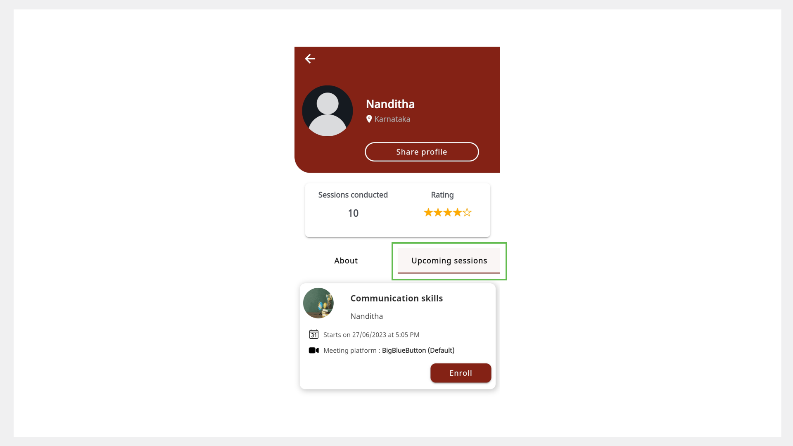

# Mentor Directory 

The Mentor Directory allows you to do the following actions:

* Discover mentors in your chosen area of expertise.
* View the number of sessions conducted by the mentor.
* View the ratings they received for sessions.
* Share a mentor profile link with your contacts or on social media.
* Discover sessions created by the mentor.
* Enroll and join sessions.

## Viewing the Mentor Profile

You can discover mentors in one of the following ways:
* Using the **Mentors** tab
* Using the **Search** bar

### Using the Mentors Tab 

The Mentor Directory lists mentor profiles in an alphabetical order. You can also search for mentors using the **Search** bar.

1. Go to the **Mentors** tab. 

     
    
2. Find a mentor and tap the mentor profile tile. 

3.	Go to the **About** tab to view the profile details.

    

### Using the Search Bar

1. In the Search bar of the Home page, tap the **Mentor Profile** tab. 

    

2. Type the mentor’s name and tap the **Search** button. 

3. Tap the mentor profile tile. 

4. Go to the **About** tab to view the profile details.

    

## Finding Sessions Created by a Mentor

1.	On the Mentor Directory, tap the mentor profile tile.
2.	Go to the **Upcoming sessions** tab to view the sessions created by the mentor.

    

## Sharing a Mentor Profile

Mentors and mentees can share a mentor profile link with their contacts or on social media.

1. Tap the mentor profile tile.

2. Tap **Share profile**.

3. Share the mentor profile link with your contacts or on social media.

    

> :::info
> To learn more about enrolling and joining sessions using the Mentor Directory, see the following topics:
> * [Enrolling for a Session](enrolling-for-a-session.md)
> * [Joining a Session](joining-a-session.md)
