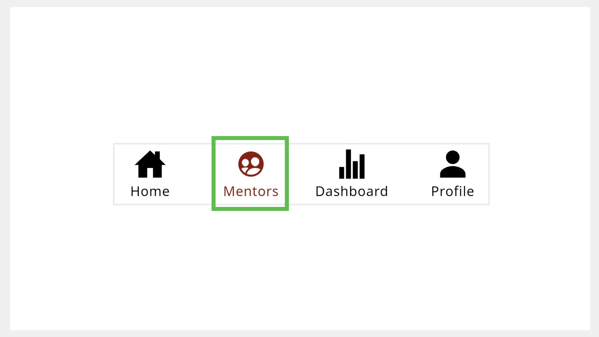
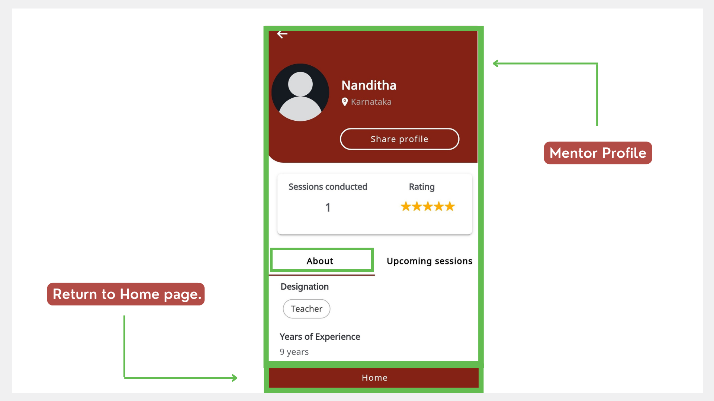

# Mentor Directory 
You can discover mentors in your chosen area of expertise using the [Mentor Directory](mentor-directory.md).

You can discover mentors in one of the following ways:
* Using the Mentors tab
* Using the Search bar

## Using the Mentors Tab
Mentor profiles are listed in an alphabetical order in the Mentor Directory. You can also search for mentors using the Search bar.

1. Go to **Mentors**. 

     

    
2. Find a mentor and tap the mentor profile tile.

    

## Using the Search Bar to View the Mentor Profile

1. In the Search bar of the Home page, select the **Mentor Profile** tab. 

    

2. Type the mentor’s name and tap **Search**. 
3. Select the mentor profile tile.

    

