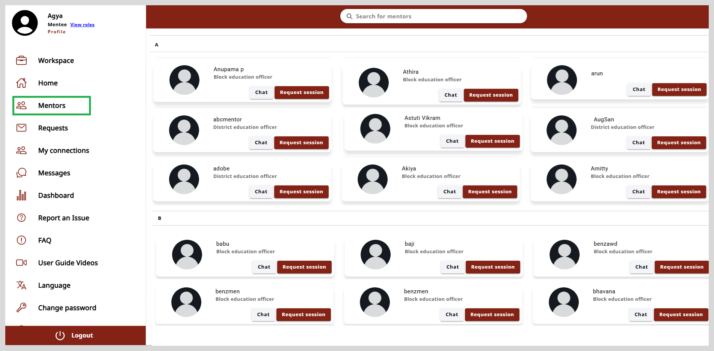
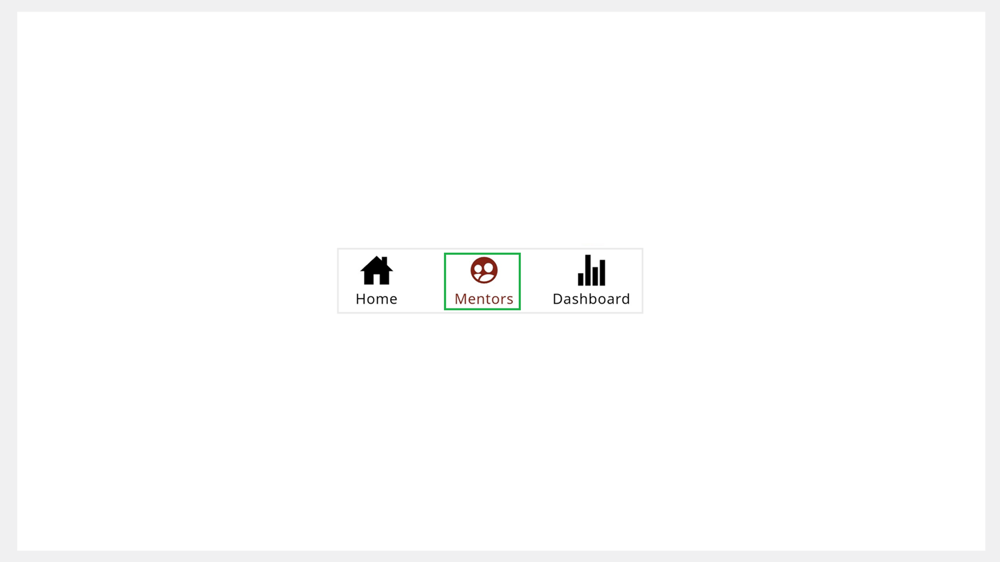
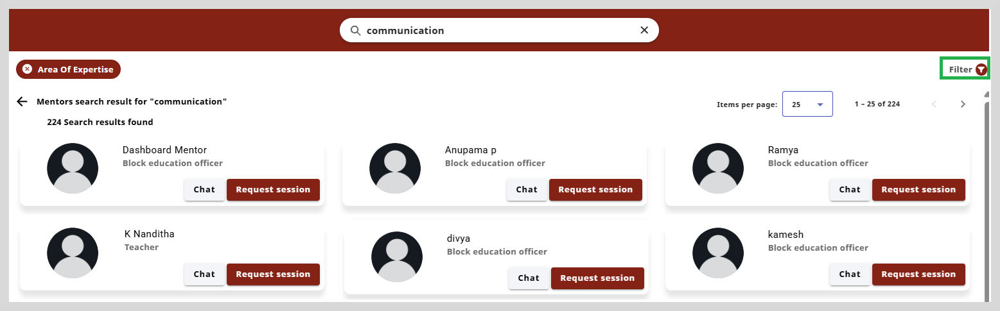
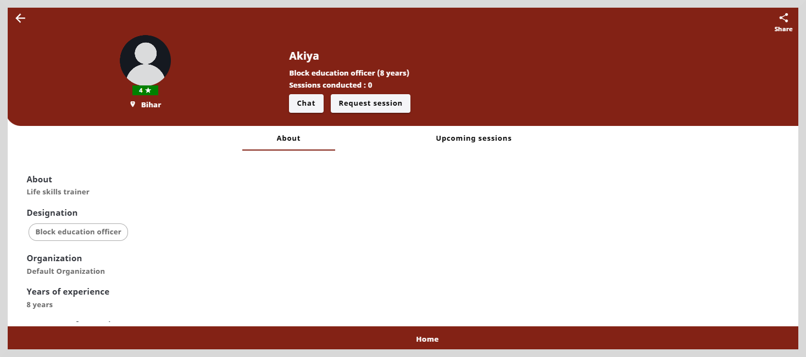
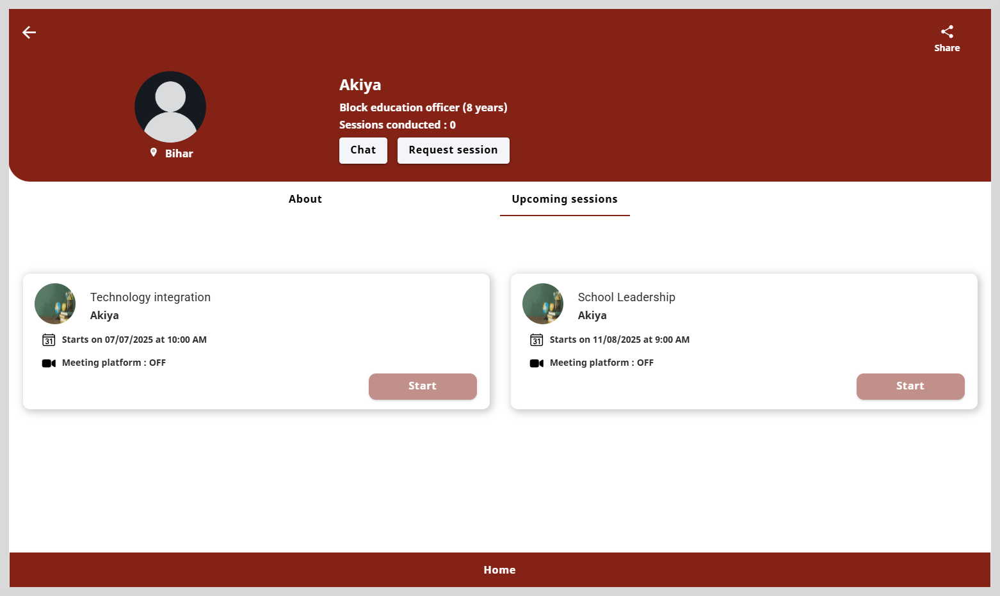
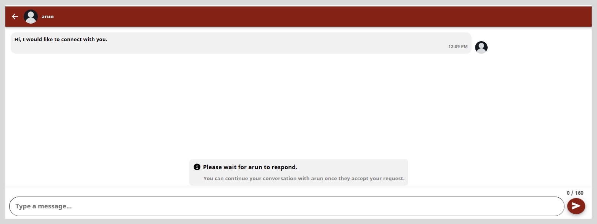

import PartialExample from './_mentored.mdx';
import Admonition from '@theme/Admonition';

# Mentor Directory 

The mentor directory lists the mentors profiles in an alphabetical order. Using the mentor directory you can perform the following actions:

* View all the mentors existing on the platform.

* View all the mentors' profiles. To do this, click anywhere on the mentor's card.

* Send a chat request or session request to a mentor.

**To view the Mentor Directory, do any one of the following actions:**

* Select **Mentors** from the left panel. The mentor directory appears.

* Go to the left panel  and select **Mentors**.

The mentor directory lists all the mentors present
on the platform in a card format in alphabetical order, as shown in the following figure.

   

    

* Go to the <b>Mentors</b> tab.

    

## Finding Mentors Using the Search Box

To find mentors on the Mentor Directory, enter a keyword such as the mentor's name or the area of expertise in the **Search** box and press **Enter**. The search results appear as mentor card tiles.

To refine your search results, you can also search for mentors based on a specific category. Click here for the following actions:

Type three or more letters of the name of the mentor or area of expertise in the search box and then press <b>Enter</b>.
The search results appear based on the search term you have typed in the search box.

  

<b>Filter</b>

You can filter the search results using the <b>Filter</b> option located on the top-right corner of the page.
You can use the criteria such as <b>Area of Expertise</b>, <b>Designation</b>, or <b>Organizations</b>.

To apply a filter do as follows:

1. Click the <b>Filter</b> option on the top-right corner of the page.

2. Select the required criteria from the <b>Filter</b> dialog box.

3. Click <b>Apply</b> to apply the filter.

To clear the filter click <b>Clear all</b>. 

<Admonition type="tip">

From the search results, you can find the respective mentor using the following ways:

<ul>
<li>Viewing the search results on different pages by clicking the <b>Next</b> or <b>Previous</b> buttons.</li>
<li>Changing the number of search results listed on the page using the <b>Items per page</b> dropdown.</li>
<li>Applying filters. To learn more, refer to the category-based search instructions.</li>
</ul>
</Admonition>

## Viewing the Mentor Profile

On the Mentor Profile page, you can do the following actions:

* View the number of sessions conducted by the mentor.

* View the ratings they received for sessions.

* Send chat request or session request to a mentor.

* Discover the upcoming sessions of the mentor.

* Share a mentor profile using a link.

**To view the Mentor Profile page, do as follows:**

1. On the Mentor Directory, click anywhere on the mentor's card whose profile you wish to view.

2. Go to the <b>About</b> tab to view the profile details.

    

<Admonition type="tip">   

Every user who registers on the platform is a mentee by default.

</Admonition>

### Finding the Upcoming Sessions of the Mentor

On the Mentor Profile page, go to the <b>Upcoming sessions</b> tab to view the sessions.

<Admonition type="info">

To learn more about enrolling and joining sessions using the mentor profile, see the following topics:

<ul>
<li><a href="enrolling-for-a-session">Enrolling for a Session</a></li>
<li><a href="joining-a-session">Joining a Session</a></li>
</ul>
</Admonition>

### Sharing Mentor Profile Links

You can share mentor profile links with your contacts.

**To share mentor profile links, do as follows:**

1. On the Mentor profile page, click **Share** to copy the mentor profile link.

2. Share the mentor profile link with your contacts.

    

## Sending a Message Request to the Mentor

Using the **Chat** option, you can send a message to the mentor. The mentor can accept or reject the message request.

**To chat with the mentor, do as follows:**

1. Click **chat** on the mentor's card you wish to connect to. The chat window appears.

2. Type your message in the space provided at the bottom of the page.

3. Click the send button to send your message.

 You will be able to start the conversation through messages only  when the mentor accepts the request and 
 a connection is established.

<Admonition type="info">
    

    <ul>
   <li>You can send only one message till your message request is accepted.</li>
    <li>The text message can contain letters, numbers, and special characters.</li>
    <li>The first message you send is limited to 160 characters. Subsequent messages can have a maximum of 255 characters.</li>    
    <li>You will be able to send a message to the mentor again only when the mentor has either accepted the request or rejected it. If the message gets rejected,
    the mentee can send a new message request.</li>
      
      </ul> 
       

    </Admonition>

### Accepting or Rejecting Message Requests

After the mentee sends a message, the mentor can accept or reject the chat request.
The mentee can continue to communicate with the mentor if the mentor accepts the request.
Upon rejecting the request, the mentee will receive an email notification explaining the reason for rejecting the chat request.

## Sending a Session Request to the Mentor

The mentee can request for a session  using the **Request session** option.

**To request a session, do as follows:**

1. Click **Request session** on the mentor card.

2. Enter a title for the session.

3. Set the the start date and the end date using the calendar icon.

4. Enter the agenda for the session.

5. Click **Submit request**. A message appears stating that your request has been sent successfully.

