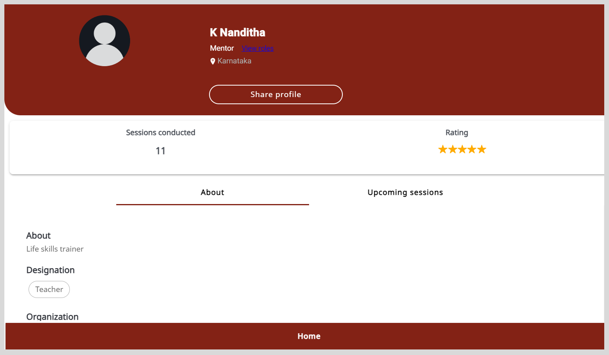
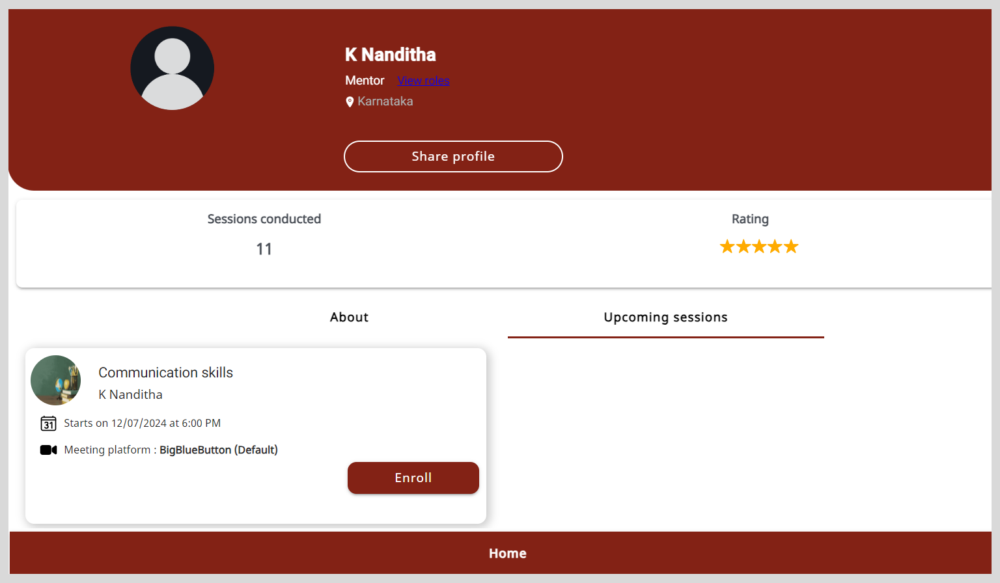

import PartialExample from './_mentored.mdx';
import Admonition from '@theme/Admonition';

# Mentor Directory 

The Mentor Directory lists mentor profiles in an alphabetical order. Using the Mentor Directory, you can discover mentors in your chosen area of expertise and view their mentor profile.

To view the Mentor Directory, do any one of the following actions:

* Select **Mentors** from the **Application** menu.

* Go to the **Application** menu  and select **Mentors**.

    

* Go to the <b>Mentors</b> tab.

    

## Finding Mentors Using the Search Box

To find mentors on the Mentor Directory, do any one of the following actions:

* Enter a search phrase such as the mentor's name  in the **Search** box and press **Enter**. The search results appear as mentor profile tiles.

* Search for mentors based on a specific category.

### Finding Mentors Based on a Category

1. To specify the search category, refer to the following table:

    <table>
    <tr>
        <th>Category</th>
        <th>Actions</th>
    </tr>
    <tr>
        <td>Search Category</td>
        <td>Click the <b>Search</b> box and select a search category such as <b>Area of Expertise</b>.</td>
    </tr>
    <tr>
        <td>Filter</td>
        <td><ol><li>Click on <b>Filter</b>.</li><li>Select one or more filter checkboxes and click <b>Apply</b>.</li><Admonition type="tip">
To clear filters, do one of the following actions:
<ul><li>Clear the filter checkbox.</li><li>Click <b>Clear all</b> to clear all the applied filters.</li></ul></Admonition></ol></td>
    </tr>
    </table>

2. Enter the search keyword. Based on the selected category, the search results appear as mentor profile tiles.

    

<Admonition type="tip">

If there are multiple search results, you can find the respective mentor using the following ways:

<ul>
<li>Viewing the search results on different pages by clicking the <b>Next</b> or <b>Previous</b> buttons.</li>
<li>Changing the number of search results listed on the page using the <b>Items per page</b> dropdown.</li>
<li>Applying filters.</li>
</ul>
</Admonition>

## Viewing the Mentor Profile

On the Mentor Profile page, you can do the following actions:

* View the number of sessions conducted by the mentor.

* View the ratings they received for sessions.

* View the additional roles assigned to the mentor.

* Discover the upcoming sessions of the mentor.

* Enroll and join sessions.

* Share a mentor profile using a link.

**To view the Mentor Profile page, do as follows:**

1. On the Mentor Directory, find a mentor and click the mentor profile tile.

2. Go to the <b>About</b> tab to view the profile details.

    

### Viewing Roles Assigned to a Mentor

You can view the list of additional roles such as that of a session manager or organization administrator that are assigned to a mentor by an organization.

<Admonition type="tip">   

A default mentee role is assigned to every user on the platform.

</Admonition>

To view the list of assigned roles, click the **View roles** link on the Mentor Profile page.

### Finding the Upcoming Sessions of the Mentor

On the Mentor Profile page, go to the <b>Upcoming sessions</b> tab to view the sessions.

<Admonition type="info">

To learn more about enrolling and joining sessions using the mentor profile, see the following topics:

<ul>
<li><a href="enrolling-for-a-session">Enrolling for a Session</a></li>
<li><a href="joining-a-session">Joining a Session</a></li>
</ul>
</Admonition>

### Sharing Mentor Profile Links

On <PartialExample mentored />, you can share mentor profile links with your contacts.

**To share mentor profile links, do as follows:**

1. On the Mentor profile page, click **Share profile** to copy the mentor profile link.

2. Share the mentor profile link with your contacts.

    

