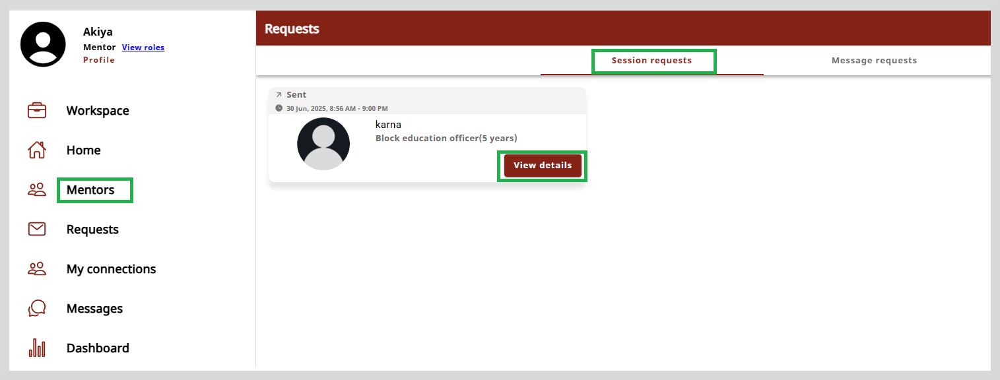
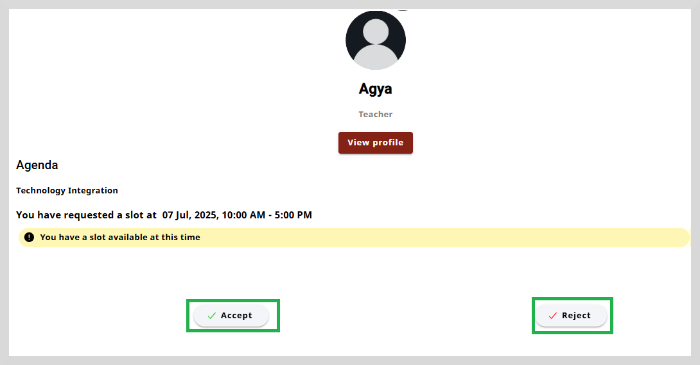
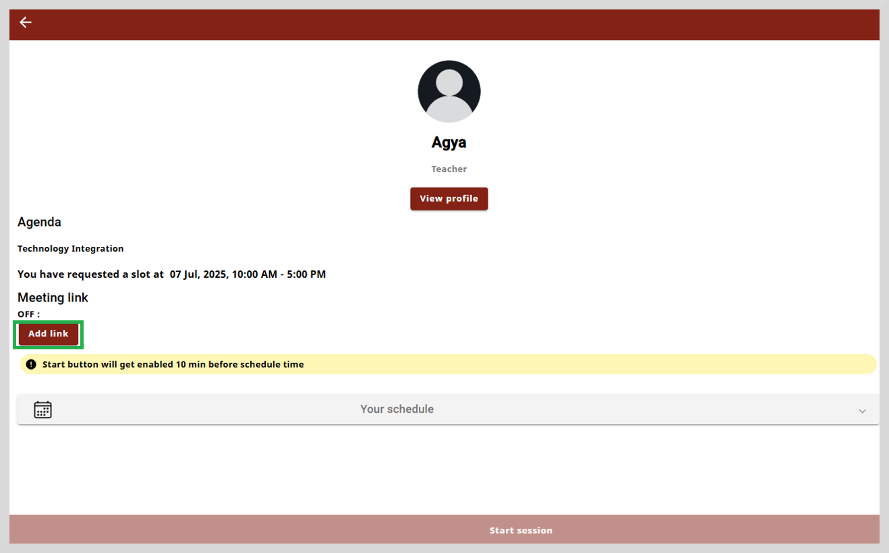
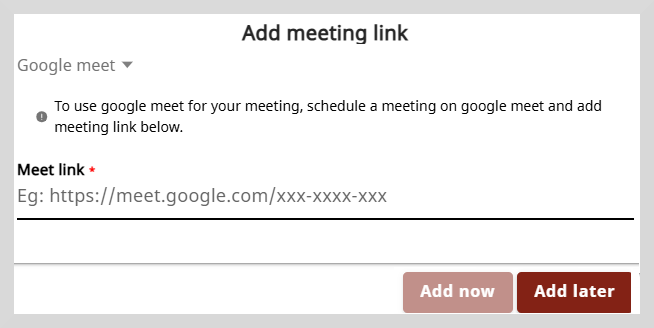
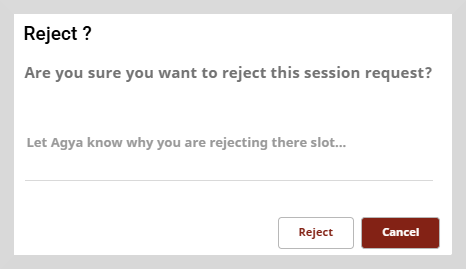
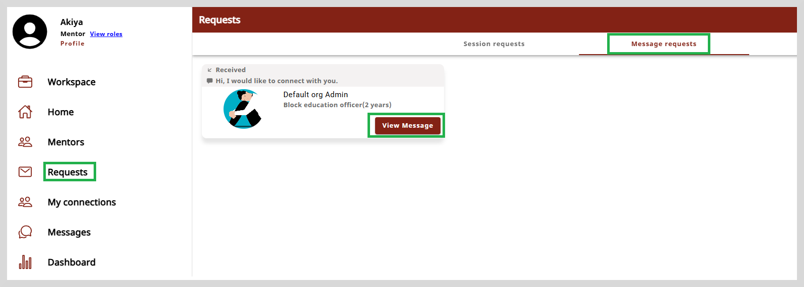
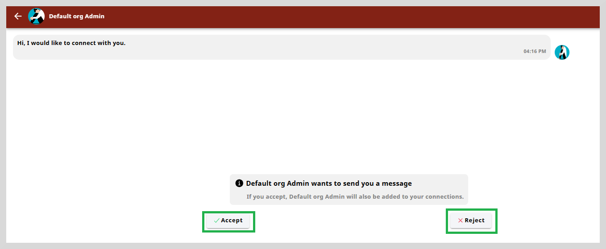

import Admonition from '@theme/Admonition';

# Responding to Requests

The Request page allows you to manage your connections. You can view the pending connections and also
decide whether to accept or reject the requests.

To view the session requests and the message requests, do as follows:

1. Select **Requests** from the left panel. The Requests page appears.

2. There are two tabs: (1) **Session requests** (2) **Message requests**

## Managing Session Requests

This tab shows the session requests that you have received, but have not yet accepted them.

  

To view the session request details, click **View details**.

## Accept or Reject Session Requests

After you receive a session request, you can accept or reject the request.

**To accept or reject a session request, do as follows:**

1. Select the **Session requests** tab.

2. Click **View details**. The session details page appears.

    

3. Do one of the following:

    * Click **Accept** to accept the request. A message appears stating that your session request has been accepted.

    

    You can share the session link with your mentee now or add it later. To share the link, click **Add link** and then enter the meeting link
    in the space provided.

         
   
     * Click **Reject** to reject the request. A message appears to confirm whether you want to reject this session request.

    

Click **Reject** to reject the session request or **Cancel** to return to the session details page.
      
## Managing Message Requests

This tab shows the message requests that you have received, but have not yet accepted them.

 

## Accept or Reject Message Requests

After you receive a chat request from a mentee or mentor, you can accept or reject the request.

**To accept or reject a message request, do as follows:**

1. Select the **Message requests** tab.

2. Click **View Message**. The message request page appears.

    

3. Do one of the following:

    * Click **Accept** to accept the request. A message appears stating that you have accepted the request and the mentee is added to your connections.

    * Click **Reject** to reject the request. A message appears to confirm whether you want to reject this message request.

Click **Reject** on the message dialog box to reject the message request or **Cancel** to return to the message request page.

