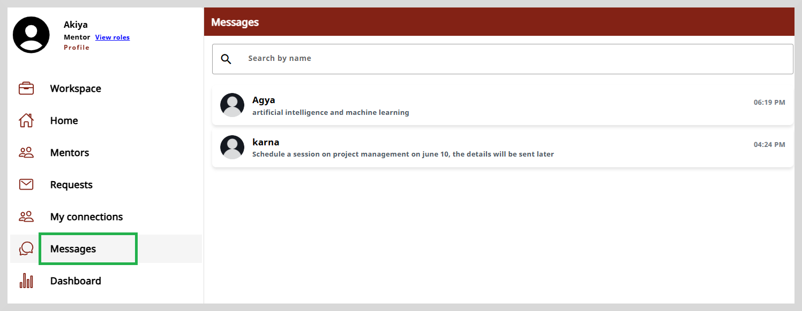
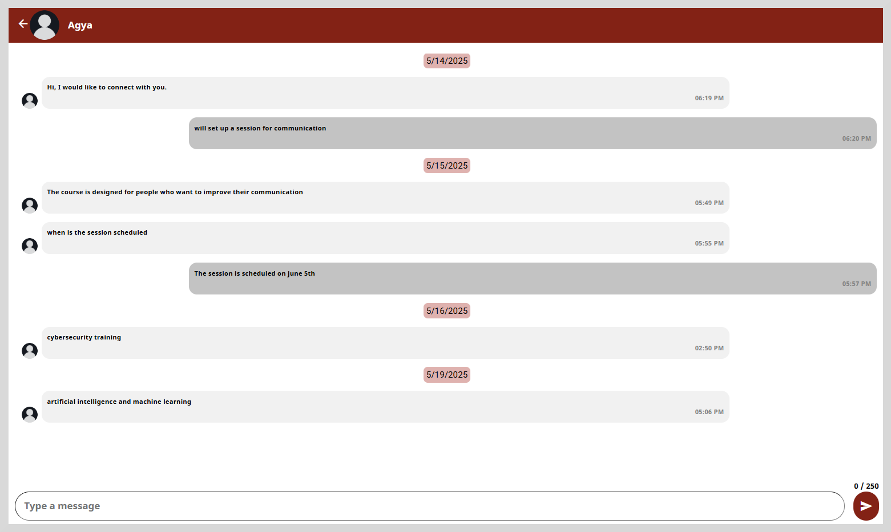

# Viewing Chat Messages

You can view all the chat messages from mentees or mentors who are connected to you.
This includes both the messages you have sent and the messages you have received.  By default, the most recent messages are displayed
on the top of the page. 
  

 

Select the row that corresponds to the mentor whose chat messages you wish to view. The chat window appears.

 

 You can also send a message to the mentee using the text box provided at the bottom of the window.

 ## Search

 To search for a specific mentee or mentor, type three or more letters in the **Search by name** text box
 located on the top of the page. The search results appear based on the search term you have typed in the search box.

 
