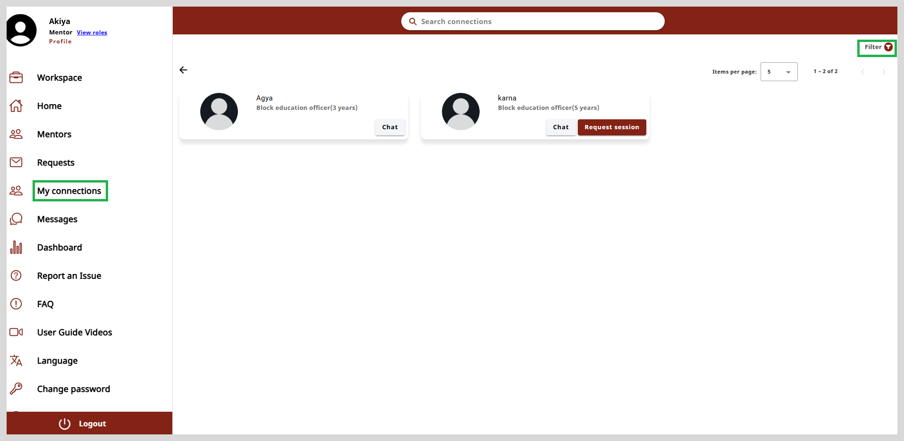
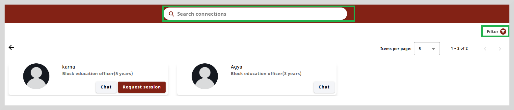
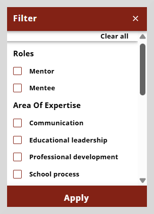

import Admonition from '@theme/Admonition';

# My Connections - Mentor

On the My Connections page, you can see the list of mentees and mentors who are connected to you. 

You can do the following from the my connections page:

* View the profile details of a mentee or a mentor.

* Chat with a mentee or a mentor.

* Request for a session with a mentor or session manager.

* Find a specific mentor or mentee using search connections.

To view the profile details, click anywhere on the mentee's or mentor's cards.

  
 
            <Admonition type="note">
            
Only the <b>Chat</b> option is available on the mentee's cards, whereas <b>Chat</b> and <b>Request Session</b> options are
             available on the mentor's cards.

            </Admonition>
        

**To chat with a mentee or mentor do as follows:**

1. Click **Chat**. The Chat window appears.

2. Type the message in the space provided at the bottom of the chat window.

3. Click the send button to send your response.

**To request a session, do as follows:**

1. Click **Request session** on the mentor card.

2. Enter a title for the session.

3. Set the the start date and the end date using the calendar icon.

4. Enter the agenda for the session.

5. Click **Submit request**. A message appears stating that your request has been sent successfully.

## Search Connections

Use the **Search connections** option to find a specific mentor or mentee.

You can search either by **Mentor name** or **Area of Expertise**. Type three or more letters in the search box and then press **Enter**. The search results appear
based on the search term you typed.

## Filter

You can filter the search results using the **Filter** option located on the upper-right corner of the page.
You can use the criteria such as **Roles**, **Area of Expertise**, **Designation**, and **Organizations**.

**To apply a filter do as follows:**

1. Click the **Filter** option on the upper-right corner of the page.

2. Select the required criteria from the **Filter** dialog box.

3. Click **Apply** to apply the filter.

To clear the filter click **Clear all**.

