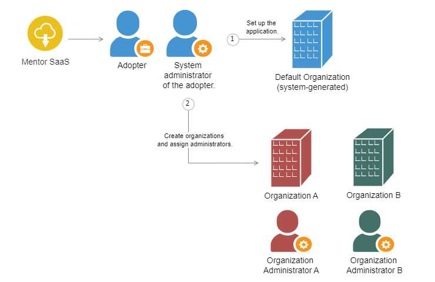

import Admonition from '@theme/Admonition';
import PartialExample from './_mentored.mdx';

# Multi-Tenant Architecture

The <PartialExample mentored /> platform has a multi-tenant architecture, and adopters can:

1. Set up the application using the microservices.

2. Create multiple organizations and assign administrators for each organization. 

3. Configure policies for organizations to manage access to their sessions and mentors.

## Default Organization

After setting up the application, a **Default** organization is created. Users who are not part of any organization are added to **Default** and the system administrator acts as the organization administrator.

  
    <Admonition type="info">
    
See the following topics to learn more about the Organization Administrator role:

    <ul>
    <li><a href="bulkupload">Uploading Users to the Application</a></li>
    <li><a href="managementorrequests">Managing Requests to Become a Mentor</a></li>
    </ul>
    </Admonition>

## Assigning Users to Organizations

Users who sign up using a shared link are assigned a mentee (default) role. The mentee's organization is detected based on the organizational domain in the email ID.

If the organization uploads email IDs to the platform, the users would receive email invites. The administrator can pre-register email IDs that belong to corporate as well as public domains. After signing up, such users are detected as organizational users in the application.

  
    <Admonition type="note">
    
After signing up, if the email ID is not registered by the organization or if it does not belong to the organizational domain, the user is added to the <b>Default</b> organization.

    </Admonition>

## Policy Architecture

From the back end, organizations can configure policies to:

* Provide conditional access to their mentors or sessions, to manage what mentees from other organizations can access.

* Provide their own mentees conditional access to mentors and sessions of other organizations.

If mentor access is denied, mentees cannot view the mentor profiles in the Mentor Directory. Similarly, if session access is denied, mentees cannot view the session hosted by the mentors of an organization.

Organizations can also configure policies to manage a session manager's access to their mentors and mentees. For example:

* If mentor access is denied, session managers cannot view an organization's mentors on the Mentor list window while they are assigning sessions.
* If mentee access is denied, session managers cannot view an organization's mentees on the Mentee list window while inviting mentees to a session.

The policies configured for the following are not interdependent and can be configured individually as needed:

* Access to mentor profiles
* Access to sessions
* Session manager's access to mentors
* Session manager's access to mentees

<table>
  <tr>
    <th>Types of Policies</th>
    <th>Description</th>
  </tr>
  <tr>
    <td>All</td>
    <td>An organization can set their policy as <b>All</b> to achieve the following:
    <ul><li>Allow other organizations' mentees to access their mentors or sessions.</li>
    <li>Allow their mentees to access other organization's mentors or sessions.
    

    <Admonition type="note">
    
Restrictions set by other organizations will be applicable for mentees.

    </Admonition>
    

    </li>
    </ul>
    </td>
  </tr>
  <tr>
    <td>Current</td>
    <td>An organization can set their policy as <b>Current</b> to achieve the following:
    <ul>
    <li>Allow their mentees to access only their mentors or sessions.</li>
    <li>Deny their mentees from accessing mentors or sessions of other organizations.</li>
    <li>Deny mentees of other organizations to access their sessions or mentors.</li>
    </ul>
    </td>
  </tr>
  <tr>
    <td>Associated</td>
    <td>
    
The <b>Associated</b> policy provides mentees with access to mentors or sessions across multiple organizations.
 
For example, if organizations A and B are linked with the <b>Associated</b> policy, only mentees belonging to these two organizations can access the details of mentors or sessions of both organizations.

    </td>
  </tr>
</table>