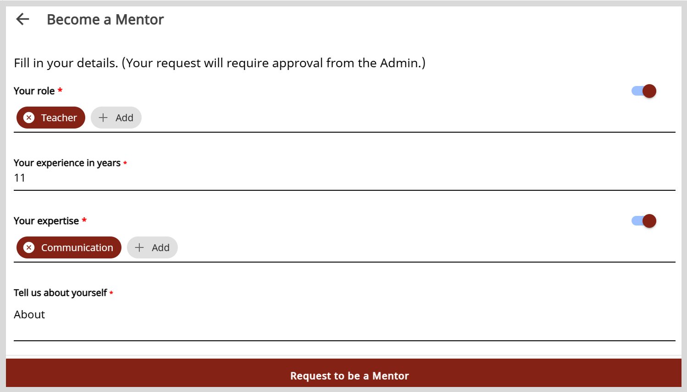

# Requesting to be a Mentor

To host sessions and share your knowledge with a community of mentees, you can create a request to become a mentor. 

**To create a request to become a mentor, do as follows:**

1. On the Home page, click **Become a Mentor**. The Become a Mentor page displaying your profile details appears.

2. Verify your profile details and edit the information if required.

    

3. Click **Request to be a Mentor**. The organization administrator should review and approve the request.