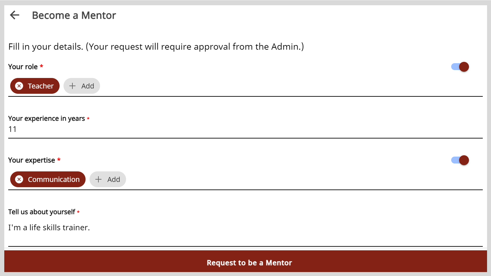

import Admonition from '@theme/Admonition';

# Requesting to be a Mentor

To host sessions and share your knowledge with a community of mentees, you can send a request to the organization administrator. 

<Admonition type="note"> 

You can send a request to be a mentor only after updating your profile.

</Admonition> 

**To send a request to become a mentor, do as follows:**

1. Do one of the following actions:

    * On the Home page, click **Become a Mentor**.
    * Go to **Profile** and click **Become a Mentor**.

        <Admonition type="info">
        
To learn more about viewing your profile, see <a href="creating-and-managing-mentee-profile">Creating and Managing a Mentee Profile</a>.

        </Admonition>

2. On the Become a Mentor page, verify your profile details and edit the information if required.

    

3. Click **Request to be a Mentor**. The organization administrator should review and approve the request.