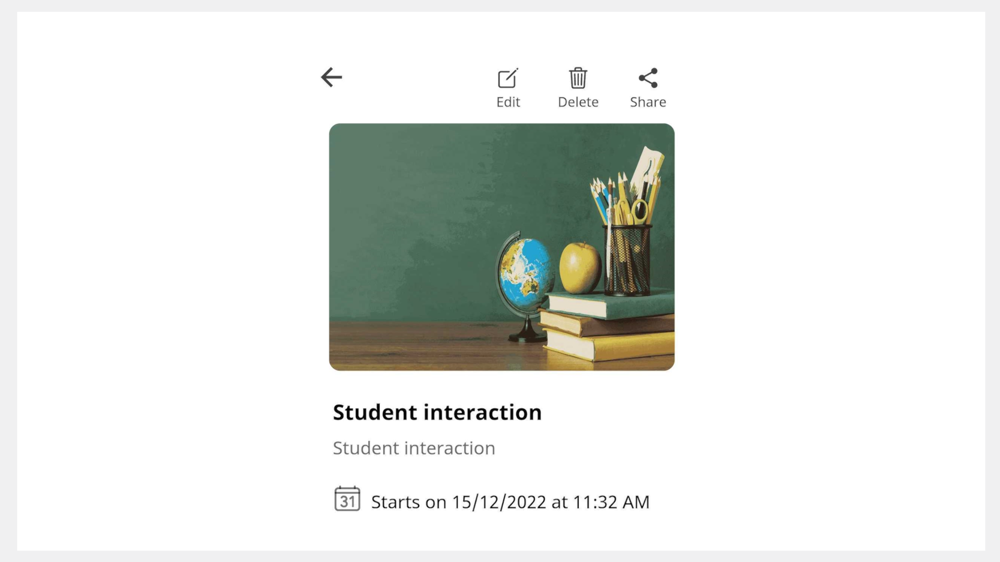
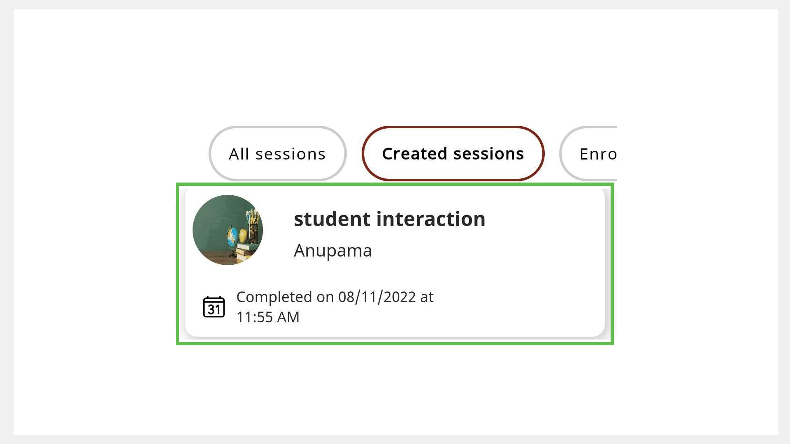

# Setting up a Session

You can create and manage mentoring sessions.

1.  Go to the Burger Menu 

 and select **Created by Me**.

2.  Select **+ Create New Session**.

3.  Enter the session details.

    > :::note 
    > * The session duration should be at least 30 minutes.
    > * While setting the end time, set an extra time of at least 10 minutes to account for any delays during the session.

    

4.  If you want to add a profile picture, tap **Add Image**. Select **Take Photo** or **Choose from Library**.

5.  Tap **Publish**. To create more sessions, tap **New Session**, and repeat the same. 

    

## Managing Your Sessions

1. To edit the session details, tap the session tile to view the Session Details page and tap **Edit**. Change the session details and tap **Publish**.

    > :::note 
    > You can edit the session after the scheduled time.

    

2. To delete the session, tap the session tile and tap **Delete**.

    > :::note 
    > You can delete a session after the scheduled time.    

3. To delete your completed sessions, select the **Past** tab, select the session, and tap **Delete**.

    
    

