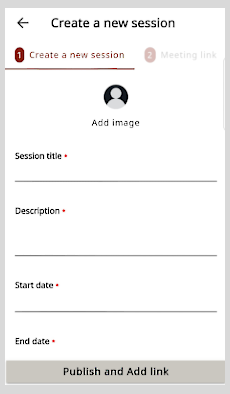

# Setting up a Session

You can create and manage mentoring sessions.

1.  Go to the **Hamburger** menu 

  and select **Created by Me**.

2.  Select **+ Create New Session**.

3.  Enter the session details.

    > :::note 
    > * The session duration should be at least 30 minutes.
    > * While setting the end time, set an extra time of at least 10 minutes to account for any delays during the session.

    

4.  If you want to add a profile picture, tap **Add Image**. Select **Take Photo** or **Choose from Library**.

5.  Tap **Publish**.

    

    > :::tip
    > To create more sessions, tap **New Session** and repeat steps 1 to 5.

## Editing a Session

1. To edit the session details, tap the session tile to view the Session Details page.

    

2. Tap **Edit**.
3. Change the session details and tap **Publish**.

## Deleting a session

To delete the session, tap the session tile and tap **Delete**. 

## Deleting Your Completed Sessions  

1. To delete your completed sessions, tap the **Past** tab.

    
    
2.  Tap the session tile and tap **Delete**.

