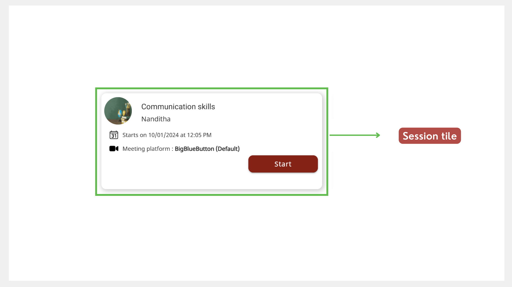
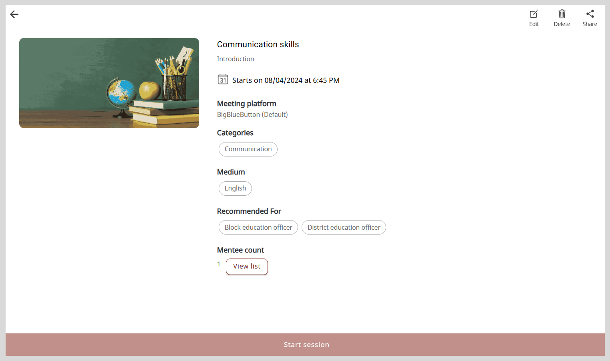

import PartialExample from './_mentored.mdx';
import FormFieldsNote from './_formfieldscustomizability.mdx';
import Admonition from '@theme/Admonition';

# Setting up a Session

To share your skills and knowledge with your mentees, you can create a <PartialExample mentored /> session and add requisite details such as:

* The topic for the session
* The session schedule
* A creative graphic or image to attract the attention of mentees
* The meeting platform

**To create a session, do as follows:**

1. On the Home page, go to <b>My mentoring sessions</b> tab.

2. Click <b>Create session</b>. The Create a new session page appears.

    

3. Optionally, to add a session image, click <b>Add image</b> and do one of the following actions:

    * To take a picture, select <b>Take Photo</b>.
    * To upload an image, select <b>Choose from library</b>.
        
  
        <Admonition type="tip">
        
Select an image that is relevant to the session topic.

        </Admonition>
        

4. Enter the session information in the <b>Session title</b> box and <b>Description</b> box.

    <FormFieldsNote />

5. 

    
If you are a mentor with Session Manager privileges, click here for the following actions:

    
    1. To select the type of session, do as follows:

        1. Click the <b>Session type</b> box.
        2. Select the session type from the <b>Session type</b> dropdown and click <b>Ok</b>.
    
        
  
            <Admonition type="note">
            
You cannot change the session type after publishing the session.

            </Admonition>
        

    
    2. To add your name in the <b>Add mentor</b> box, do as follows:

        1. Click <b>+ Add mentor</b>. The Mentor list window appears.
        2. Find your name from the list and click <b>Add</b>.

        

        
  
            <Admonition type="tip">
            
From the Mentor or Mentee list window, you can find users by:

            <ul>
            <li>Searching for the user in the <b>Search</b> box.</li>
            <li>Using filters such as the user's organization or designation.</li>
            <li>Changing the number of users listed on the page using the <b>Items per page</b> dropdown.</li>
            </ul>
            </Admonition>
        

    3. To invite mentees, do as follows:

        1. Click <b>+ Add mentee</b>. The Mentee list window appears.
        2. Find a mentee from the list and click <b>Add</b>.

        

    
  
        <Admonition type="tip">
        
It is optional to invite mentees to a Public session.

        </Admonition>
    

    
  
        <Admonition type="note">
        
You cannot add mentees after the session enrollment limit is reached. If you add new mentees after this limit is reached, a <i>session seats full</i> message appears.

        </Admonition>
    

    

6. To schedule a session, do as follows:
    
    1. Click the <b>Start date</b> box and <b>End date</b> box.
    2. Select the date and time from the date and time picker.
    3. Click .

    
  
        <Admonition type="note">
        
The session duration should be at least 30 minutes.

        </Admonition>
    

7. Select an option from the following:
    
    * <b>Recommended for</b>
    * <b>Categories</b>
    * <b>Medium</b>

    

        <Admonition type="tip">
        <ul>
        <li>To cancel the selection, click the option again.</li>
        <li>To add a new option, do as follows:</li>
            <ol>
            <li>Click <b>+ Add</b> and enter the new option.</li>
            <li>Click <b>Ok</b>.</li>
            </ol>
        <li>To select all the options, turn on the toggle.</li>
        </ul>
        </Admonition>
    

     

8. Click <b>Publish and add link</b>. The session is published on the platform and mentees can now view your session.
    
    

        <Admonition type="note">
        
You must set the meeting platform on the <b>Meeting Link</b> tab.

        </Admonition>
    

    

    

        <Admonition type="tip">
        
To go back and edit the session details, do as follows:

        <ol>
        <li>Go to the <b>Edit session</b> tab.</li>
        <li>Make the necessary changes and click <b>Save</b>.</li>
        </ol>
        </Admonition>
    

9. On the <b>Meeting link</b> tab, select a meeting platform from the <b>Add meeting link</b> menu.

    

        <Admonition type="note">
        
If you haven't selected a meeting platform, <b>BigBlueButton</b> is set as the default platform.

        </Admonition>
    

    <table>
    <tr>
        <th>Meeting Platform</th>
        <th>Meeting Information</th>
    </tr>
    <tr>
        <td>BigBlueButton</td>
        <td>No action required.</td>
    </tr>
    <tr>
        <td>Google Meet</td>
        <td>Copy and paste the call link in the <b>Meet link</b> box.</td>
    </tr>
    <tr>
        <td>WhatsApp</td>
        <td>Copy and paste the call link in the <b>WhatsApp</b> box.</td>
    </tr>
    <tr>
        <td>Zoom</td>
        <td>
Do the following actions:
<ol><li>Copy and paste the meeting link in the <b>Zoom link</b> box.</li><li>Copy and paste the meeting ID in the <b>Meeting ID</b> box.</li><li>Copy and paste the passcode in the <b>Passcode</b> box.</li></ol></td>
    </tr>
    </table>

10. Click <b>Submit</b>. The meeting information is added.

    

        <Admonition type="tip">
        
You can find the new session on <b>My mentoring sessions</b> tab on the Home page.

        
On <b>My mentoring sessions</b> tab, you can view your upcoming and completed sessions.

        </Admonition>
    

## Tracking the Number of Enrollments

You can view the number of mentees who have enrolled or those who were invited to the session.

1. On <b>My mentoring sessions</b> tab, click the session tile.

    

2. View the **Mentee count** value.

    

## Viewing the List of Mentees

On the Mentee list window, you can do the following actions:

* View mentees' details.
* Check whether the mentees have enrolled for the session or have been invited to the session.

**To view the list of mentees, do as follows:**

1. On <b>My mentoring sessions</b> tab, click the session tile.

    

2.  On the Session Details page, click **View list**. The Mentee list window appears.

    

    <Admonition type="tip">
    
Click the <b>Download</b> link to download the mentee list as a CSV file.

    </Admonition>
    

    

## Updating a Session

1. On <b>My mentoring sessions</b> tab, click the session tile.

    

2. On the Session Details page, click <b>Edit</b>. The Edit session details page appears.

    

### Updating the Session Details

<Admonition type="note">

You can edit the session details only until the start of the session.

</Admonition>

1. On the Edit session details page, go to the <b>Edit session</b> tab.

2. Make the necessary changes to:

    * The session information.
    * 

        
The list of mentees who were invited to the session. If you are a mentor with Session Manager privileges, you can update the list using any one of the following actions:

        <ul>
        <li>To invite new mentees, click <b>+ Add New Mentee</b> and add mentees from the list.</li>
        <li>To remove mentees from the list, click the mentee's name and click <b>Remove</b> on the Mentee list window.</li>
        </ul>
        

    * The session image. To update the session image, click <b>Add image</b> and do one of the following actions:
        
        * To take a picture, select <b>Take Photo</b>.
        * To upload an image, select <b>Choose from library</b>.
        * To remove the existing image, select <b>Remove current photo</b>.

        
  
            <Admonition type="tip">
            
Select an image that is relevant to the session topic.

            </Admonition>
        

3. Click <b>Save</b>. The session details are updated.

### Updating the Meeting Information

<Admonition type="tip">

After starting the session, you can go back to <PartialExample mentored /> and edit the meeting information. The session that you have started appears as <i>Live</i> on the <b>My mentoring sessions</b> tab.

</Admonition>

1. On the Edit Session Details page, go to the <b>Meeting link</b> tab and make the necessary changes.

2. Click <b>Submit</b>. The meeting information is updated.

## Deleting a Session

<Admonition type="note">

You can delete the session only until the start of the session.

</Admonition>

**To delete the session, do as follows:**

1. On <b>My mentoring sessions</b> tab, click the session tile.

    

2. Click the session tile and click <b>Delete</b>.

    

3. Click <b>Yes delete</b> on the confirmation dialog. The session is cancelled and is removed from the <b>My mentoring sessions</b> tab of the Home page.

