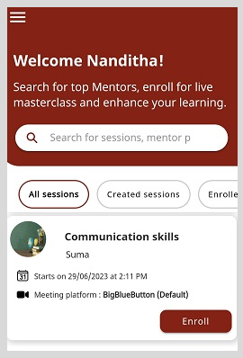

import PartialExample from './_mentored.mdx';

# Signing up as a Mentor

First-time users should create an account on <PartialExample mentored />.

**To sign up as a mentor, do as follows:**

1.  Install the <PartialExample mentored /> application from Google Play Store.

2.  Open <PartialExample mentored /> and select **Sign up**. 

3.  Select **Mentor** and tap **Continue**.

4.  Enter your details:
    - **Name**
    - **Email**
    - **Password**
    - **Secret code**

    > :::note  
     Enter a valid email ID. 

5. Tap on **Sign up as mentor**.

6.  Enter the OTP sent to your registered email ID and tap **Verify and login**. 
    > :::tip  
    > To receive a new OTP, tap **Resend OTP**.

7.  On the Terms of Use page, review the terms of use and policy settings. 

8. Select the checkbox to agree to the terms of use and policy settings. 

9. Tap **Proceed**. The Home page appears.

    

## Logging out

To log out, go to the **Application** menu 
 
 and tap **Logout**.
