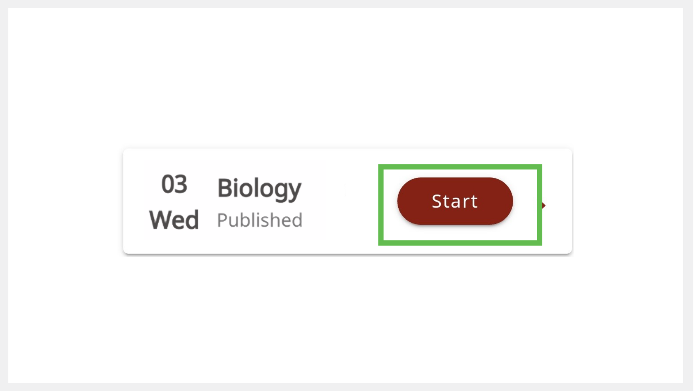
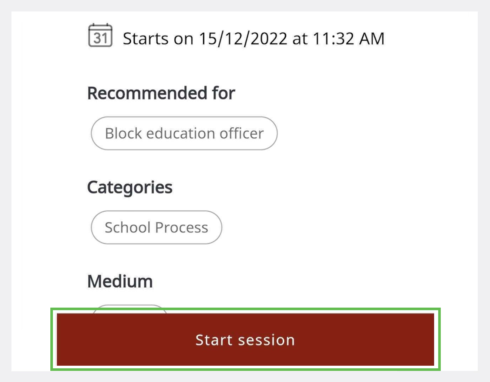

import PartialExample from './_mentored.mdx';

# Starting a Session 

<PartialExample mentored /> application is integrated with BigBlueButton to enable the hosting of mentoring sessions.

> :::note  
>* You can start the session only 10 minutes before the scheduled time.
>* You can start the session anytime within the time allocated for the session.

You can start a session in one of the following ways:

* Using the **Start** button
* Using the session tile
* Using the shared link

## Using the Start Button

1.  Go to the **Hamburger** menu  and tap **Created by Me**.

2. Tap the **Upcoming** tab.

3. Find the session and tap **Start**.
   >:::tip 
   >If an error occurs, go back to <PartialExample mentored /> and tap **Start**.
   :::
   
   

## Using the Session Tile

1.  Go to the **Hamburger** menu  and tap **Created by Me**.

2. Tap the **Upcoming** tab.

3. Tap the session tile and tap **Start Session**.

   
   
## Using the Shared Link

1. Tap on the session link which was shared with your contacts or on social media. 

2. Tap **Start Session**.

   

## Configuring the BigBlueButton Settings

BigBlueButton meeting window appears on your web browser.

### Configuring Your Microphone

1. To connect your microphone, tap the **Microphone** option and select **Yes**. 

  > :::note
  > Microphone may turn on by default.

2.	To mute your microphone, tap the **Microphone** button. Tap again to unmute it.

### Configuring the Participants' Microphones

1. Go to the **User Toggle List**.

2. To mute the microphone, do any one of the following actions:

* Tap the **Manage Users** icon and select **Mute All Users Except Presenter** to mute the participants' microphones.

* Tap the participant's name and select **Mute User** to mute a specific participant's microphone.

### Configuring the Webcam 

1. To turn on the webcam, tap the **Webcam** button.

2. Tap **Start Sharing**. Before turning on your webcam, you can change the webcam (you can use either your front or rear camera of your phone) and background. 

   > :::note  
   >* The webcam may turn on by default. 
   >* To change your webcam and background, tap the **Webcam** button, make changes, and close the window.

3. To turn it off, tap the **Webcam** button and tap **Stop Sharing**.

### Checking the Quality of Your Internet Connection 

The **Connection Status** icon located on the top portion of the window indicates the quality of your internet connection.

### Disabling Session Recording

To pause the recording, tap the **Record** button and tap **Yes**. Tap the button again to resume recording.

### Leaving the Session

To leave the meeting, go to the **Options** menu and select **Leave Meeting**.
    
> :::note  
> If you leave the meeting unintentionally (by pressing the back key on your phone or closing the meeting tab), go back to <PartialExample mentored /> and tap **Start**. 

>
>:::caution 
>If you leave the meeting after the end time, you cannot rejoin.

### Ending the Session

To end the meeting, go to the **Options** menu and select **End Meeting**.

### Best Practices

- Unmute your [microphone](#configuring-the-microphone) only when necessary.

- Maintain a neat background and attire before you turn on your [webcam](#configuring-the-webcam). 

- Use respectful language while sharing any information. Discuss only mentoring-related topics.

## Using BigBlueButton Features

The BigBlueButton application provides more features which are as follows:

* Managing meeting settings
* Managing users
* Adding user status
* Sending chat messages
* Sharing notes
* Presenting a file
* Using the whiteboard
* Starting a poll
* Selecting a random user
* Creating breakout rooms

>:::info 
>To learn more, see [BigBlueButton Help](https://bigbluebutton.org/teachers/tutorials/).
