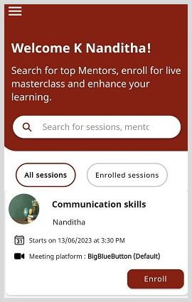

import PartialExample from './_mentored.mdx';
import Shiksha from './_shiksha.mdx';
import ReactPlayer from 'react-player';
import overviewURL from './media/overview.mp4';

# About the MentorED Mobile Application

The <PartialExample mentored /> mobile application is integrated with the microservices hosted by <Shiksha shiksha />. The application uses the authentication, notifications, user management, and mentoring services hosted on the <Shiksha shiksha /> Cloud. 

The following table summarizes the activities mentors and mentees can carry out using the <PartialExample mentored /> mobile application.

| Mentors | Mentees |
| ----------- | ----------- |
| Create and manage live mentoring sessions.| Discover and join live mentoring sessions. |
| Interact with the participants. | Interact with the mentor and other participants.|
| Collaborate with other mentors on mentoring sessions. | Collaborate with other participants. |
| Use the mentor directory to get to know other mentors. | Use the mentor directory to get to know more about mentors.|
|Provide feedback on mentoring sessions.| Provide feedback on mentoring sessions.|

To start using the <PartialExample mentored /> mobile application
1. Download and install the <PartialExample mentored /> application from Google Play store.
2. After successful installation, run the mobile application. The <PartialExample mentored /> splash screen appears: 

   

    <ReactPlayer playing controls url={overviewURL} loop="false" />

   

3. If this is the first time that you are using <PartialExample mentored /> mobile application, see 
   * [Signing up on <PartialExample mentored /> as a Mentor](signing-up-as-a-mentor)
   * [Signing up on <PartialExample mentored /> as a Mentee](signing-up-as-a-mentee)

   

