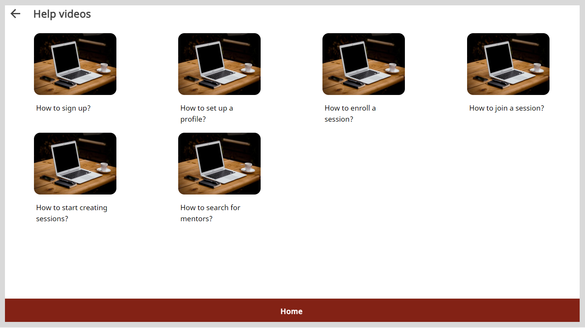

import BurgerMenu from './media/burgermenu-icon.png'

# Viewing the Help Videos

You can find video instructions about using the application features.

**To view the video instructions, do as follows:**

1. Do one of the following actions:

    * On <b>desktop</b>: Select <b>User Guide Videos</b> from the left panel. 

    * On <b>mobile</b>: Tap the  icon and select <b>User Guide Videos</b>.

2. Click the appropriate tile to play the video instructions.

    