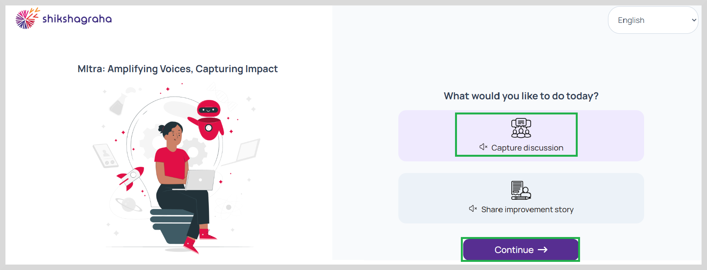
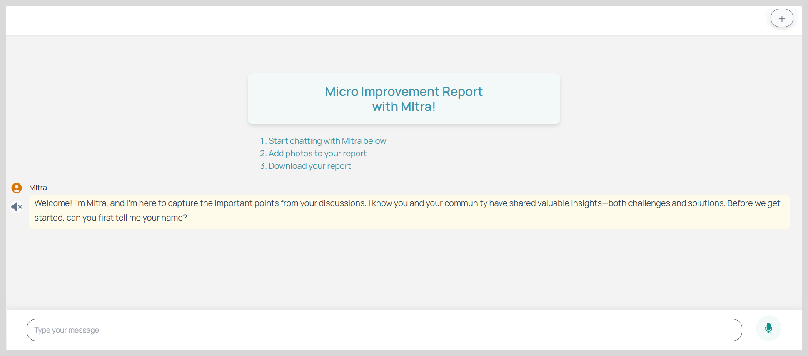
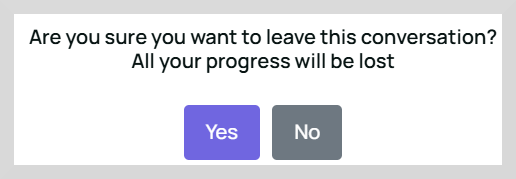
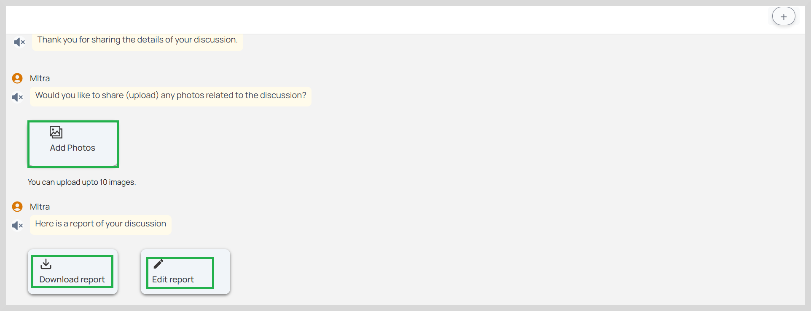

import Admonition from '@theme/Admonition';

# Capture Discussion

To capture the challenges and solutions discussed, do as follows:

1. On the home page, select your preferred language from the top-right corner of the screen. 

2. Select **Capture Discussion** and then click **Continue**.   

3. Click **Accept** on the Terms and Conditions of Use.  

4. Start chatting with Mitra to answer a few questions. 

5. You can record or type the response for a question using any one of the following ways:  

*   To record the discussion click the microphone icon and then record your response and then stop recording.

*   Type the details in the text box provided and then click the send button.

6. To quit from MItra application, click the '**+**' icon in the top-right corner and then click **Yes** on the dialog box.

    <Admonition type="note"> 
    
All questions are to be answered. Do not skip any questions.

     </Admonition>
    
 

    <Admonition type="tip"> 
    
To process the data and provide an enriched report, make sure you answer every question in detail.

     </Admonition>
    
 

7. After answering all questions, you can also add images related to the discussion.

8. Click **Add Photos** to upload the photos.

    <Admonition type="note"> 
    
A maximum of ten photos can be uploaded..

     </Admonition>
    
 

After uploading the photos you can generate the reports using the <a href="discussionreports">Download report </a> option.
