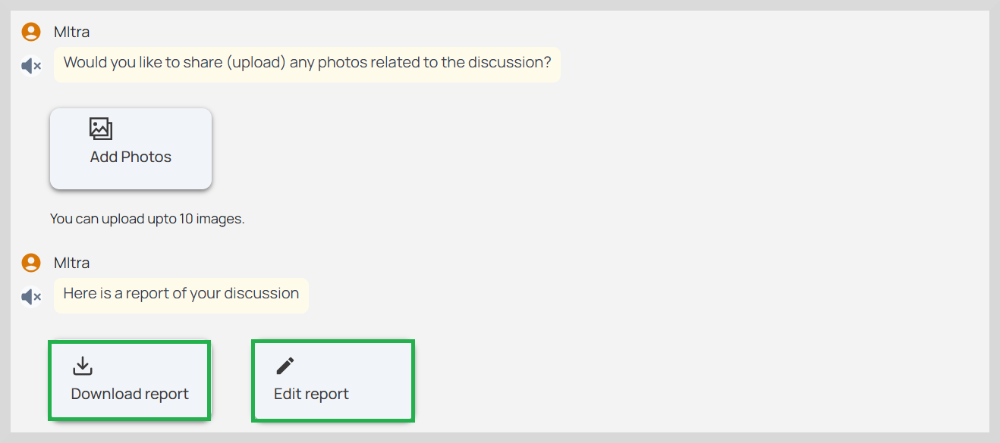
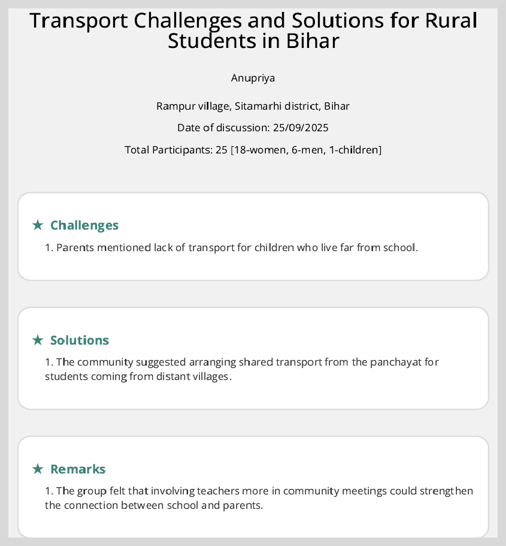

import Admonition from '@theme/Admonition';

# Download Discussion Reports

MItra generates an enriched report that includes comprehensive details on the challenges raised and the solutions suggested
during the discussions.

You can do the following actions:

* Edit a report

* Download a report

## Edit a Report

You can add new challenges and solutions or edit the existing challenges and solutions. You cannot edit your
profile details, date of discussion and total participants.

To edit the report, click **Edit report**. Make the necessary changes and then click **Save** to save the changes.

## Download Reports

This report gives the following details:

*   Solutions suggested to address the problem along with photos if uploaded while capturing the discussions.
*   Total number of people who attended the discussion
*   Date on which the discussion was held

*   Challenges addressed in the community 
*   Impact assessment of the discussion outcomes; whether the measures implemented have successfully improved the lives of community members.

To download the report to your device, click **Download report**.

