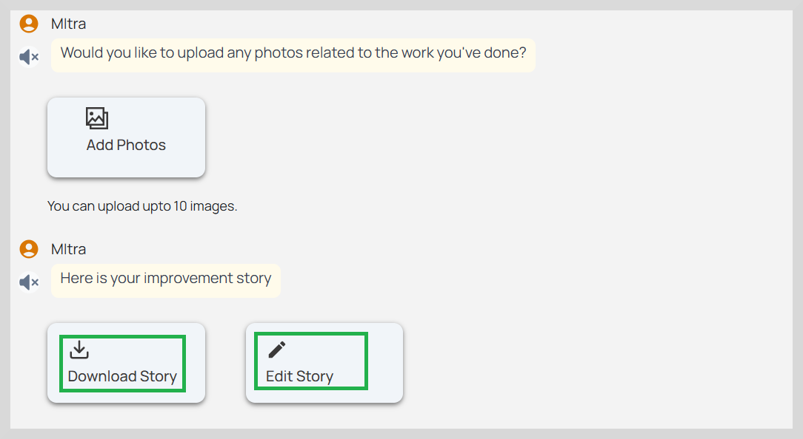
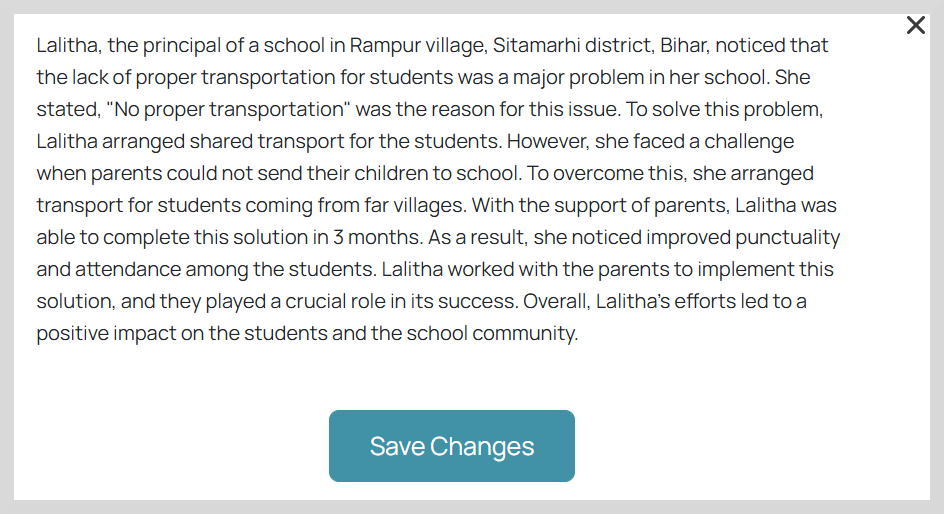
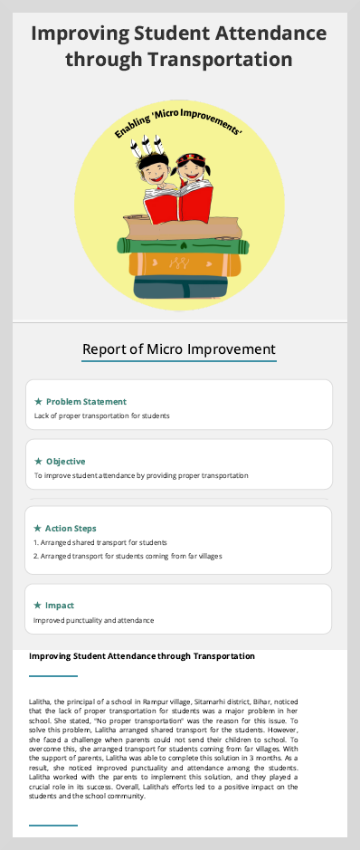

import Admonition from '@theme/Admonition';

# Download Improvement Story

MItra automatically generates a document containing the information captured through discussions, the challenges addressed, the actions that were taken to tackle the problem, and the changes achieved.

You can edit and download the improvement stories.

You can make the necessary changes if required.

To edit a story, do as follows:

1. Click **Edit Story**. A dialog box appears with textual content consisting of community discussions, challenges and their corresponding outcomes.

2. Make the necessary changes.

2. Click **Save Changes** to save your changes.

## Download Story

To download the story to your device, click **Download Story**.

